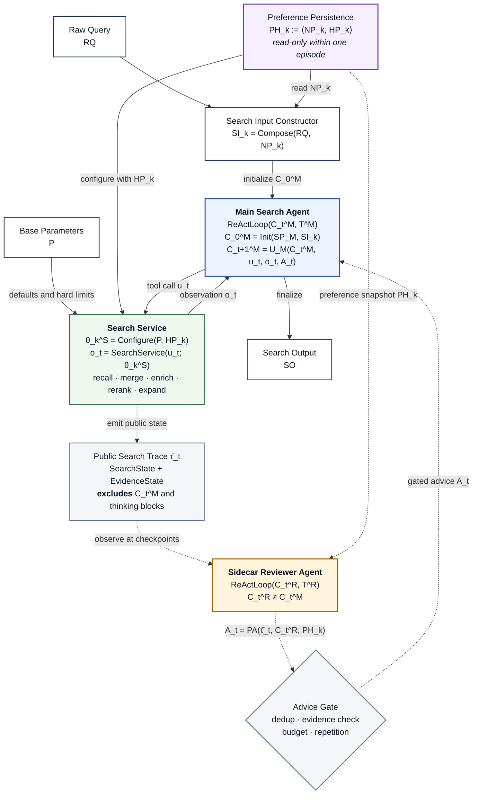
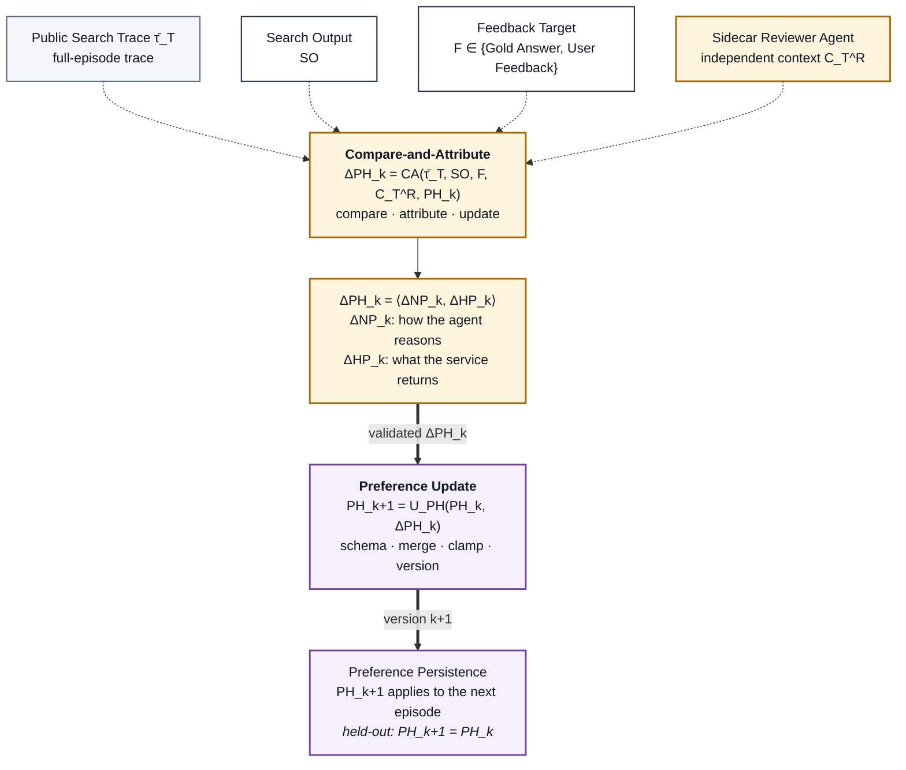
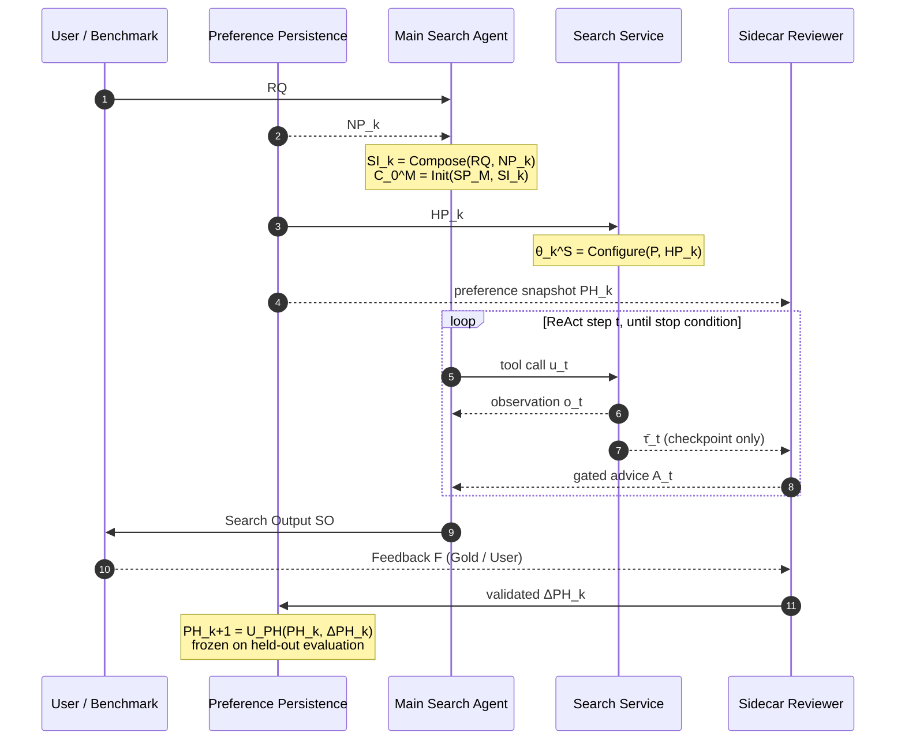
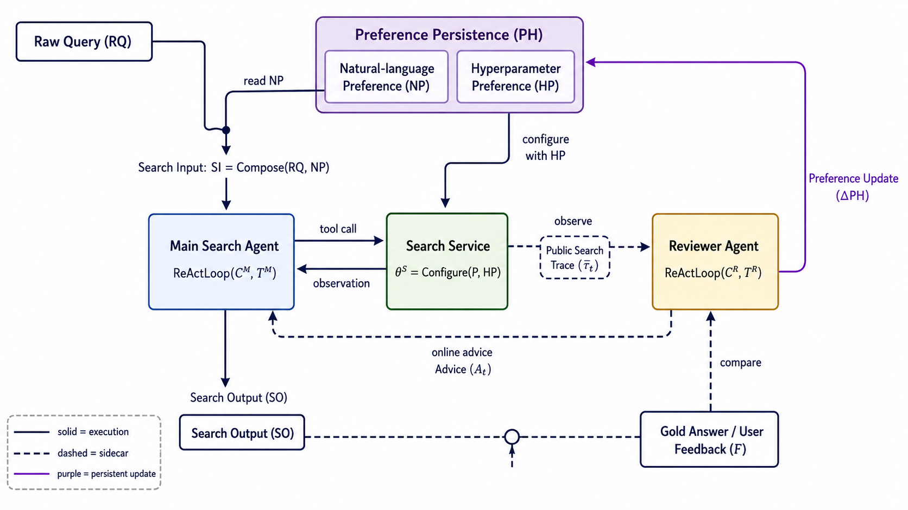

# 检索架构设计

## 1. 设计目标与总体判断

本系统面向科研场景下的复杂学术查询。实现 Agentic Search：将**查询理解、受控检索、轨迹审查、偏好沉淀和结构化输出**组织成一个可迭代、可观测的闭环。

整体模型可以概括为**双时间尺度、双上下文、四模块**：

- **双时间尺度**
  - $t$：单次检索任务（episode）内部的 ReAct step；
  - $k$：跨检索任务的 Preference 版本号。
- **双上下文**
  - $C^M_t$：Main Search Agent 的私有上下文，包含它自己的推理；
  - $C^R_t$：Reviewer 的独立上下文，只看公开轨迹。
  - 二者严格满足 $C^M_t \neq C^R_t$，这是本设计的核心机制，而不是实现细节。
- **两个环**
  - **在线环（online loop，尺度 t）**：Reviewer 观察轨迹并回灌建议，只读偏好；
  - **学习环（offline loop，尺度 k）**：拿到 Gold / User Feedback 后更新持久偏好。
- **四模块**
  1. **Main Search Agent**：理解查询、规划检索步骤、调用检索工具、生成最终结果。
  2. **Search Service**：封装多源检索、缓存、跨源归一、去重、引文扩展和候选排序。
     它被 Main Agent 当作工具使用，但不负责自然语言决策。
  3. **Sidecar Reviewer Agent**：在线提供过程建议；离线比较结果并归因，提出偏好更新。
  4. **Preference Persistence**：持久化用户偏好，分为自然语言偏好和检索超参数偏好。

其中，Agent 负责需要语言推理的决策，Service 负责可测试的检索能力，
Preference Persistence 负责跨任务记忆。三者职责不能互相替代。

## 2. 变量定义与数据契约

### 2.1 符号表

| 符号 | 名称 | 定义 |
| --- | --- | --- |
| $RQ$ | Raw Query | 用户原始检索请求 |
| $PH_k$ | Preference State | 第 $k$ 个版本的持久偏好 |
| $NP_k$ | Natural-language Preference | 面向 Agent 推理的自然语言偏好 |
| $HP_k$ | Hyperparameter Preference | 面向 Search Service 的结构化参数偏好 |
| $P$ | Base Parameters | 系统预设的基础检索参数与安全上限 |
| $\theta^S_k$ | Search Configuration | 由 $P$ 与 $HP_k$ 共同生成的运行配置 |
| $SI_k$ | Search Input | Main Agent 的自然语言任务输入 |
| $SP_M$ / $SP_R$ | System Prompt | Main / Reviewer 的系统提示 |
| $T^M$ / $T^R$ | Tool Set | Main / Reviewer 的工具集 |
| $C^M_t$ | Main Context | Main Agent 在第 $t$ 步的私有上下文 |
| $C^R_t$ | Review Context | Reviewer 在第 $t$ 步的独立上下文 |
| $u_t$ | Search Request | Main 发给 Search Service 的工具请求 |
| $o_t$ | Search Observation | Search Service 返回的结构化观察值 |
| $\bar{\tau}_t$ | Public Search Trace | Reviewer 可见的公开检索轨迹（见 §5.1） |
| $A_t$ | Advice | Reviewer 给 Main 的在线建议 |
| $SO$ | Search Output | 最终检索结果 |
| $F$ | Feedback Target | Gold Answer 或 User Feedback |
| $\Delta PH_k$ | Preference Update | Reviewer 提出的偏好更新量 |

### 2.2 异构偏好

$$
PH_k := \langle NP_k,\; HP_k \rangle
$$

所谓偏好是**异构结构对**，两个分量走两条不同的转换路径，不应理解成 $NP + HP$ 的加法。
用两个显式构造函数把这条区分固定下来：

$$
\begin{aligned}
SI_k       &= \mathrm{Compose}(RQ,\; NP_k) \\
\theta^S_k &= \mathrm{Configure}(P,\; HP_k)
\end{aligned}
$$

- $NP$ 改变 **Agent 如何理解和执行任务**：查询理解、子查询分解、结果组织、回答风格；
- $HP$ 改变 **Search Service 实际返回什么结果**：检索源选择、时间窗、各源 top-k、
  召回/扩展开关、排序权重、预算分配。

$\mathrm{Configure}$ 不是简单覆盖：$P$ 提供默认值、允许范围和安全上限，$HP_k$ 只能覆盖
被显式标记为可调的字段，不能突破系统级预算、日期边界和并发上限：

$$
\begin{aligned}
\theta^S_k &= \mathrm{Configure}(P,\; HP_k) \\
           &= \mathrm{clamp}\big(\mathrm{override}(P.\mathrm{defaults},\; HP_k \cap P.\mathrm{mutable\_fields}),\; P.\mathrm{limits}\big)
\end{aligned}
$$

### 2.3 Episode 快照

每个 episode 开始时建立不可变的 `RunSnapshot`，本次运行只读这个快照：

```text
RunSnapshot = {
  rq: RQ,
  si: SI_k,
  theta: θ^S_k,
  ph_version: k,
  constraints: { end_date, budget, max_iterations, max_reviewer_calls, ... }
}
```

在线环内 $PH_k$ 只读。Reviewer 在 episode 结束后产生的 $\Delta PH_k$ 默认从下一个 episode
生效（$PH_{k+1}$），避免运行中的参数漂移破坏可复现性。

### 2.4 输出契约

```text
SO = {
  papers: ranked paper list,
  answer: query-oriented synthesis,
  relations?: paper/citation graph,
  evidence?: supporting snippets or fields,
  metadata: { query_id, ph_version: k, theta_digest, budget_spent, trace_summary }
}
```

`papers` 是评分主对象；`answer`、`relations` 和 `evidence` 用于满足结构化展示和
可复核性要求。结果不是纯文本：以上每一项都应能机器读取。

## 3. Main Search Agent：查询到结果的主循环

定义通用形式 $\mathrm{Agent} = \mathrm{ReActLoop}(\mathrm{Context} + \mathrm{Tools})$，于是：

$$
\begin{aligned}
\text{Main Search Agent} &= \mathrm{ReActLoop}(C^M_t,\; T^M) \\
C^M_0     &= \mathrm{Init}(SP_M,\; SI_k) \\
u_t       &= \mathrm{SelectAction}(C^M_t) \\
o_t       &= \mathrm{SearchService}(u_t;\; \theta^S_k) \\
C^M_{t+1} &= U_M(C^M_t,\; u_t,\; o_t,\; A_t)
\end{aligned}
$$

$T^M$ 不是直接暴露给模型的一组裸 API，而是 Search Service 依据 $\theta^S_k$ 生成的
**受约束工具视图**：同一个工具在不同 $HP_k$ 下可用参数范围不同。每次工具调用都携带
本次 episode 的查询约束、日期边界和预算上下文；工具返回结构化 $o_t$，而不是要求
Agent 解析终端文本。

典型流程：

1. 从 $SI_k$ 提取研究主题、方法、数据集、领域、venue、时间和其他约束。
2. 对复杂问题做子查询分解和查询改写，形成若干互补的检索策略。
3. 调用 Search Service 进行多源召回、候选合并和初步筛选。
4. 根据候选质量、覆盖缺口和 $A_t$ 调整下一轮查询、过滤条件或引文扩展方向。
5. 对候选论文做相关性、权威性、时效性和多样性权衡，生成排序列表。
6. 按查询意图组织摘要、证据和可选关系图，形成 $SO$。

Main Agent 可以保留完整的私有上下文和 reasoning，但这部分内容**不属于 Reviewer 的输入**
（§5.1）。循环终止条件由四部分共同决定：

$$
\begin{aligned}
\mathrm{stop} = \;& \mathrm{agent\_stop} \\
\lor \;& \mathrm{budget\_exhausted} \\
\lor \;& \mathrm{max\_iterations\_reached} \\
\lor \;& \mathrm{marginal\_recall\_gain\_too\_low}
\end{aligned}
$$

预算和最大迭代次数由运行时强制执行，不能只依赖模型自行遵守。

## 4. Search Service：被 Agent 调用的检索能力层

本节只定义契约与边界；接口、多源分工、特征体系与可训练 rerank 的完整设计见
[`search-service.md`](./search-service.md)。

Search Service 对 Agent 暴露少量稳定的领域工具，内部再编排多个检索源和本地算法：

$$
o_t = \mathrm{SearchService}(u_t;\; \theta^S_k)
$$

```text
query plan
    -> multi-source recall
    -> ID normalization and deduplication
    -> metadata/full-text enrichment
    -> BM25/embedding/rule rerank
    -> citation or related-work expansion
    -> budgeted result selection
```

各环节职责：

- **召回**：根据查询意图和 $HP_k$ 选择检索源。当前规划以 OpenAlex 为主召回，
  arXiv 补充时间敏感的预印本、标题/ID 精确命中和全文入口；
  不把不同源的相关性分数直接相加。具体的源分工见 `search-service.md` §3.2。
- **归一与去重**：统一 DOI、arXiv ID、OpenAlex ID，
  通过外部 ID 映射和标题/作者等字段合并同一论文的多源记录。
- **富集**：按需补齐摘要、作者、venue、开放获取信息、引用计量、主题分类和引文关系。
  论文全文或引用内容只在后续筛选确实需要时获取，控制 token、延迟和 API 次数。
- **候选排序**：先用确定性的过滤、去重和 BM25 等低成本步骤缩小候选集，再使用
  embedding 或模型判别做精排。不同来源的分数不可直接比较时使用名次融合，
  并保留来源分数和排序依据。
- **扩展**：围绕高置信候选进行 references / citations / related works 扩展；扩展深度、
  扇出、并发和总候选数必须有界。

横切约束：

- 所有网络调用有超时、有界重试、速率限制和明确失败分类；
- 每个入口显式接收 `end_date`，不得召回评测时间边界之后的论文；
- 记录来源、查询、命中数、耗时、缓存命中、API 调用数、Token 和费用；
- 跨源合并后只向 Agent 返回统一的 Paper schema，避免 Agent 自己重复实现去重；
- 超过预算时停止当前策略并返回可解释的部分结果，不静默丢弃失败请求。

因此，Search Service 是"能力与约束"的边界，Main Search Agent 是"策略与解释"的边界。
Service 同时是 $\bar{\tau}_t$ 的**生产者**：可观察状态由 Service 和运行时计算，而不是由 Agent 自述。

## 5. Sidecar Reviewer Agent：独立上下文的旁路审查

$$
\begin{aligned}
\text{Sidecar Reviewer Agent} &= \mathrm{ReActLoop}(C^R_t,\; T^R) \\
C^R_0     &= \mathrm{Init}(SP_R,\; \bar{\tau}_0,\; PH_k) \\
C^R_{t+1} &= U_R\big(C^R_t,\; \Delta(\bar{\tau}_t,\; \bar{\tau}_{t+1})\big)
\end{aligned}
$$

逻辑上每次审查面对当前完整状态；传输上只发送初始快照和状态增量，避免重复消耗
Reviewer context。

### 5.1 Public Search Trace：审查输入边界

$\bar{\tau}_t$ 是运行时从可观察状态构造的审查工件，**不是 $C^M_t$ 的镜像**：

```text
τ̄_t = {
  original_query: RQ,
  runtime_constraints,
  preference_snapshot: PH_k,
  search_state: SearchState_t,
  evidence_state: EvidenceState_t,
  current_output?: SO,
  feedback?: F
}

SearchState_t = {
  issued_queries, selected_sources, filters,
  candidate_counts, dedup_stats, ranking_summary,
  expansion_frontier, budget_spent, failures
}

EvidenceState_t = {
  papers, abstracts_or_snippets, citation_edges,
  bibliometric_fields, source_ids, evidence_ids, coverage_signals
}
```

`SearchState` 表示"系统做了什么以及消耗了什么"，`EvidenceState` 表示"系统找到了什么
以及证据质量如何"。$\bar{\tau}_t$ 可以包含 Main Agent 已发出的查询串、筛选参数、工具结果和
阶段性输出，但**不能**包含：

- Main Agent 的完整私有上下文 $C^M_t$；
- thinking blocks、chain-of-thought 或隐藏推理；
- 未经 Search Service 计算和归一的原始内部对象。

由此得到明确的 epistemic boundary：

```text
Main Agent : knows why it searched
Reviewer   : knows what the search produced
```

这正是保持 $C^M_t \neq C^R_t$ 的手段。传完整 $C^M_t$ 会让 Reviewer 被主模型的推理 anchor，
退化成"同一上下文里的第二次自我反思"，本设计的收益假设（§10）也就无从检验。

### 5.2 在线：Online Policy Advice（PA）

$$
A_t = \mathrm{PA}(\bar{\tau}_t,\; C^R_t,\; PH_k)
$$

即：观察 Main 的公开搜索轨迹 → 结合 Reviewer 独立上下文 → 读取当前持久偏好 →
输出影响下一步搜索策略的建议。Reviewer 检查查询是否覆盖关键约束、结果是否存在明显
噪声、是否需要补充来源或引文扩展、证据是否足够、当前策略是否接近预算上限：

```text
A_t = {
  advice_id, priority: high | medium | low,
  action: refine_query | add_source | expand_citation | rerank | stop,
  target, instructions, evidence_ids,
  confidence, expected_effect, novelty_key
}
```

$A_t$ 先经过运行时 **gate**，再通过事件/消息通道进入 $U_M$。gate 至少执行：

- `advice_id` 和 `novelty_key` 去重；
- 检查建议是否引用当前 `EvidenceState` 中存在的 `evidence_ids`；
- 检查建议是否突破来源、并发、API、Token 或墙钟预算；
- 检查同一 action 是否连续无效或重复出现；
- 限制每轮和每次 episode 的 Reviewer 调用次数。

Reviewer 不直接改写 $C^M_t$，也不绕过 Search Service 调用未预算的 API。重复的
`stop` / `done` / `no issue` 等无行动建议必须被 gate 丢弃或合并。

Reviewer 不需要在每个 token 或每个普通事件上运行，只在 checkpoint 触发：

1. 初始召回完成；
2. 一轮候选合并或引文扩展完成；
3. 检测到覆盖不足、噪声突增、来源失衡或预算接近上限；
4. 生成最终 $SO$ 之前。

这同时控制额外成本，并避免把"持续说话"误当成审查质量。

### 5.3 离线：Compare-and-Attribute（CA）

原设想中的 `Compare Answer` 过窄：Reviewer 不只比较答案，还要把结果归因到具体的
搜索行为。因此改名为 **Compare-and-Attribute**：

$$
\begin{aligned}
\Delta PH_k &= \mathrm{CA}(\bar{\tau}_T,\; SO,\; F,\; C^R_T,\; PH_k) \\
\Delta PH_k &= \langle \Delta NP_k,\; \Delta HP_k \rangle
\end{aligned}
$$

- **Compare**：比较 $SO$ 与 Gold Answer / User Feedback，识别漏召回、误召回、
  排序偏差、展示偏好和关系图缺失；
- **Attribute**：判断问题来自 query formulation、召回、排序、停止策略还是参数配置；
- **Update**：按归因结论分别形成 $\Delta NP_k$（改 Agent 怎么想）和 $\Delta HP_k$（改 Service
  返回什么）。

Reviewer 通过 `update_preference` 工具提交带理由、证据引用、版本和置信度的更新，
而不是直接写入存储。

### 5.4 模型配置

$$
\begin{aligned}
\mathrm{MainModel}     &= \mathrm{model\_main} \\
\mathrm{ReviewerModel} &= \mathrm{model\_reviewer}
\end{aligned}
$$

**不同模型不是架构前提**。默认实验先使用相同模型，以隔离上下文/角色分离的收益；
随后再将 `model_reviewer` 替换为成本更低或能力不同的模型，测量 model diversity 的
额外收益。角色分离是必选设计，模型异构是可选实验因素。

## 6. Preference Persistence：跨任务偏好

$$
PH_{k+1} = U_{PH}(PH_k,\; \Delta PH_k)
$$

两条转换路径必须保持分离：

$$
\begin{aligned}
NP_k + RQ &\xrightarrow{\ \mathrm{Compose}\ } SI_k       &&\to \text{Main Agent behavior} \\
HP_k + P  &\xrightarrow{\ \mathrm{Configure}\ } \theta^S_k &&\to \text{Search Service configuration} \\
PH_k      &\xrightarrow{\ \mathrm{snapshot}\ } \bar{\tau}_t &&\to \text{explicit preference memory in review context}
\end{aligned}
$$

- $NP_k$ 影响查询理解、子查询分解、结果组织和回答风格；
- $HP_k$ 影响检索源选择、时间窗、top-k、扩展策略、排序权重和预算分配；
- $PH_k$ 作为审查上下文中的显式偏好记忆，用于判断结果是否符合用户长期偏好；
- $P$ 提供默认值、允许范围和安全上限；
- $U_{PH}$ 必须做 schema 校验、冲突合并、幅度限制和版本化；
- 当前 episode 读取的 `RunSnapshot` 保持不变，$PH_{k+1}$ 用于后续 episode。

这样既能利用用户反馈持续优化，又不会因一次异常反馈把当前或所有后续请求的检索行为
无界改变。

## 7. 两个循环必须严格分开

### 7.1 在线搜索循环（尺度 t）

$$
u_t \to o_t \to \bar{\tau}_t \to A_t \to C^M_{t+1}
$$

此时 $PH_k$ **只读**，不应随意更新。在线环内唯一的可变状态是 $C^M_t$ 和 $C^R_t$。

### 7.2 跨任务学习循环（尺度 k）

$$
(\bar{\tau}_T,\; SO,\; F) \to \mathrm{CA} \to \Delta PH_k \to PH_{k+1}
$$

更新只发生在取得可验证反馈之后。Held-out 测试时必须冻结：

$$
PH_{k+1} = PH_k
$$

否则测试集信息会通过偏好通道泄漏到后续 episode。

### 7.3 最简函数式表达

从外部看，整个系统可以被包装成一个工具：

$$
(SO,\; \bar{\tau}_T) = \mathrm{Search}(RQ;\; PH_k,\; P)
$$

但内部真实状态是：

$$
S_t = (C^M_t,\; C^R_t,\; PH_k)
$$

因此：**externally callable as a tool ≠ internally reducible to a stateless tool。**
所有可复现性要求（§9）都来自这条区分。

## 8. 端到端结构图

### 8.1 ASCII 逻辑结构图

```text
Legend
---------------------------------------------------------------------------
  --->    primary execution / data flow       (online, step t)
  ...>    sidecar observation / gated advice  (read-only)
  ===>    validated persistent update         (offline, version k)
  [ ]     immutable value (input / output)
  +--+    stateful module

  t = ReAct step inside one search episode
  k = preference-state version across search episodes
---------------------------------------------------------------------------

                                           [ Raw Query : RQ ]
                                        |
                                        v
                    +-------------------+-------------------+
                    | SEARCH INPUT CONSTRUCTOR              |
     NP_k --------->| SI_k = Compose(RQ, NP_k)              |
     ^              +-------------------+-------------------+
     |                                  | SI_k
     |                                  v
 +---+------------------------+  +------+------------------------------+
 | PREFERENCE PERSISTENCE     |  | MAIN SEARCH AGENT         step t    |
 |                            |  | ReActLoop(C^M_t , T^M)              |
 | PH_k := < NP_k , HP_k >    |  |                                     |
 |                            |  | C^M_0     = Init(SP_M , SI_k)       |
 | NP_k -> agent reasoning    |  | u_t       = SelectAction(C^M_t)     |
 | HP_k -> service behavior   |  | C^M_(t+1) = U_M(C^M_t,u_t,o_t,A_t)  +<....+
 |                            |  | SO        = Finalize(C^M_T)         |     :
 | read-only within episode   |  +---+-----------------------------+---+     :
 +-------------+--------------+                                              :
               | HP_k                | u_t                     o_t ^         :
               |                     v                             |         :
               |                 +---+-----------------------------+---+     :
               |                 | SEARCH SERVICE                      |     :
               +---------------->| theta^S_k = Configure(P , HP_k)     | A_t :
                                 |                                     | gate:
    [ P : base parameters ] ---->| o_t = SearchService(u_t; theta^S_k) |     :
                                 |                                     |     :
                                 | recall / merge / enrich / rerank    |     :
                                 | expand / budget / accounting        |     :
                                 +------------------+------------------+     :
                                                    | emit public state      :
                                                    v                        :
                                    [ Public Search Trace : tau_t ]          :
                                    [ SearchState + EvidenceState ]          :
                                    [ excludes C^M_t and thinking ]          :
                                                    :                        :
                                   observe at checkpoints (read-only)        :
                                                    v                        :
                                 +------------------+------------------+     :
                                 | SIDECAR REVIEWER AGENT              |     :
                                 | ReActLoop(C^R_t , T^R)              |     :
                                 | context asymmetry: C^R != C^M       |     :
                                 |                                     |     :
                                 | online :                            |     :
                                 |   A_t   = PA(tau_t , C^R_t , PH_k)  +.....+
                                 |           -> runtime gate -> Main   |
                                 |                                     |
                                 | offline:                            |
                                 |   dPH_k = CA(tau_T , SO , F ,       |
                                 |               C^R_T , PH_k)         |
                                 +------+---------------------+--------+
                                        ^                     |
                                        :                     | validated dPH_k
    [ Search Output : SO ] .............+                     |
                                        :    +----------------+-----------------+
    [ Feedback F : Gold / User ] .......+    | PREFERENCE UPDATE                |
                                             | PH_(k+1) = U_PH(PH_k , dPH_k)    |
                                             | schema / merge / clamp / version |
                                             +----------------+-----------------+
                                                              |
    <=========================================================+
    PH_(k+1) applies to the next episode, never to this one

External functional view :   ( SO , tau_T ) = Search( RQ ; PH_k , P )
Internal stateful view   :   S_t = ( C^M_t , C^R_t , PH_k )
```

图中 Main 与 Search Service 之间是一对严格配对的箭头：

```text
Main  -- tool call u_t -->  Search Service
Main  <-- observation o_t --  Search Service
```

`tau_t` 画在 Search Service 的下游，是因为公开轨迹由 Service 和运行时**计算**得到
（`SearchState` / `EvidenceState` 都是 Service 侧的记账结果），而不是由 Main Agent
自述其推理。这正是 §5.1 中边界能够成立的原因。

右侧点线是 sidecar 回流通道：Reviewer 的 $A_t$ 不直接写入 $C^M_t$，而是先经过运行时
gate（图中通道旁的 `A_t / gate` 标注，规则见 §5.2），再作为 $U_M$ 的一个输入参与
下一步 $C^M_{t+1}$。图中唯一的双线 `===` 是跨 episode 的持久更新：它离开本次 episode
的时间轴，写回 Preference Persistence 后才在 $k+1$ 生效。

### 8.2 Mermaid：在线搜索循环（尺度 t）

在线环内 $PH_k$ 只读，唯一的可变状态是 $C^M_t$ 和 $C^R_t$：



### 8.3 Mermaid：跨任务学习循环（尺度 k）

学习环只在拿到可验证反馈之后运行，输出写回偏好存储并从下一个 episode 生效：



### 8.4 一次 episode 的时序



### 8.5 渲染版



生成图适合展示和汇报，它省略了版本下标 $k$ 与 advice gate，并把 $PH$ 画成单个模块。
由于生成式图片可能在箭头连接上产生轻微歧义，
**论文和实现中的规范逻辑以 §8.2–§8.4 的 Mermaid 与本文公式为准。**

## 9. 边界、可观测性与实现原则

1. **上下文隔离是核心机制**：Reviewer 默认只看 $\bar{\tau}_t$，不看 $C^M_t$；不能用
   "复制主上下文后再调用另一个模型"冒充 cross-context review。
2. **角色分离优先于模型异构**：先验证同模型、独立上下文的收益，再评估便宜 Reviewer
   或不同模型带来的额外收益。
3. **Reviewer 是受控旁路控制器**：只在 checkpoint 触发，$A_t$ 必须经过 gate，不能
   成为持续输出、重复建议或无界调用 API 的第二个主搜索器。
4. **两个循环不得混用**：在线环只读 $PH_k$；学习环只在拿到可验证 $F$ 之后更新，
   held-out 上冻结 $PH_{k+1} = PH_k$。
5. **Agent 与 Service 解耦**：模型只决定检索策略和参数；网络访问、去重、排序基础算子、
   状态构造、预算检查和记账由 Service / 运行时负责。
6. **偏好不是隐式记忆**：$NP_k$ 与 $HP_k$ 都要有 schema、版本、来源、置信度和生效范围。
7. **结果不是纯文本**：论文列表、证据、关系图、失败项和运行元数据都应能机器读取。
8. **成本是控制流的一部分**：运行前估计并在运行中强制限制模型调用、API 调用、
   Reviewer 调用、并发、候选规模和墙钟时间；缓存命中与冷启动分别统计。
9. **评测可复现**：记录 query ID、`end_date`、$k$、$\theta^S_k$ 摘要、模型/Provider 版本、
   预算、原始事件、$\bar{\tau}_t$、Advice gate 结果和最终 $SO$，使 Precision、Recall、F1、
   延迟、调用数和 Token 可复核。

## 10. Reviewer 价值的验证假设与消融

核心假设不是"多一个模型一定更好"，而是：

$$
\begin{aligned}
\text{Reviewer gain} = \;& \text{context separation gain} \\
+ \;& \text{role asymmetry gain} \\
+ \;& \text{optional model diversity gain} \\
- \;& \text{extra compute / noise}
\end{aligned}
$$

Cross-context review 的已有结果和关于 OMP Advisor 的工程反馈只能作为设计依据，
不能直接当作本项目上的结论。尤其需要警惕 Reviewer 额外调用带来的纯算力收益、
浅层误判、重复 advice 和错误的 stop 建议。

因此固定以下消融组：

```text
A. Main only                      baseline
B. Main + self-reflection         same model / same context
C. Main + Reviewer                same model / separate context (C^R ≠ C^M)
D. Main + Reviewer                different model / separate context
E. Main + Reviewer + learning     separate context + PH_k update enabled
```

A–D 只运行在线环；E 额外打开学习环（$\mathrm{CA} \to \Delta PH_k \to PH_{k+1}$）。
在相同 query、`end_date`、最大预算、停止条件和输出 schema 下比较：

- Precision、Recall、F1；
- 端到端延迟、Main / Reviewer 模型调用数、API 调用数、输入/输出 Token；
- Advice 接受率、重复率、无效率、触发后候选增益；
- Reviewer 触发次数、预算超限率和失败请求数；
- 缓存命中与冷启动结果；
- （E 组）$\Delta HP_k$ 幅度、偏好版本回滚次数、跨 episode 的收益曲线。

结果只在 $C-A$、$D-C$、$E-D$ 等差异上解释对应机制，不能把 D 或 E 的绝对分数
直接归因于上下文隔离。若 Reviewer 的收益不超过额外成本或重复建议显著增加，
默认退化为更少 checkpoint 或 Main-only，而不是强制保留 Reviewer。

相关依据和限制：

- OMP Advisor 的实现说明其拥有独立 Agent、ToolSession、context 和 system prompt：
  <https://github.com/can1357/oh-my-pi/blob/main/docs/advisor-watchdog.md>
- OMP 社区已有关于默认传入 thinking blocks 的配置讨论：
  <https://github.com/can1357/oh-my-pi/issues/8071>
- OMP 曾出现重复 advice 刷屏问题，说明 Reviewer 必须有去重、gate 和停止条件：
  <https://github.com/can1357/oh-my-pi/issues/3520>
- Self-correction、Cross-Context Review 和独立 critique model 的论文证据支持
  "隔离优先、异构可选"的假设，但其数据集、任务和样本规模不等同于本项目：
  <https://arxiv.org/abs/2310.01798>
  <https://arxiv.org/html/2603.12123v1>
  <https://arxiv.org/html/2509.20502v2>
  <https://arxiv.org/abs/2411.16579>

该版本保留原设想中的四个核心实体，把 Reviewer 从"读取主轨迹的旁路 Agent"收紧为
"读取 $\bar{\tau}_t$ 的独立上下文审查器"，把偏好从隐式记忆收紧为版本化的 $PH_k := \langle NP_k, HP_k \rangle$，
并把在线环与学习环在时间尺度上彻底分开，使 Reviewer 的有效性、成本和噪声都落在
可验证的实验设计里。
