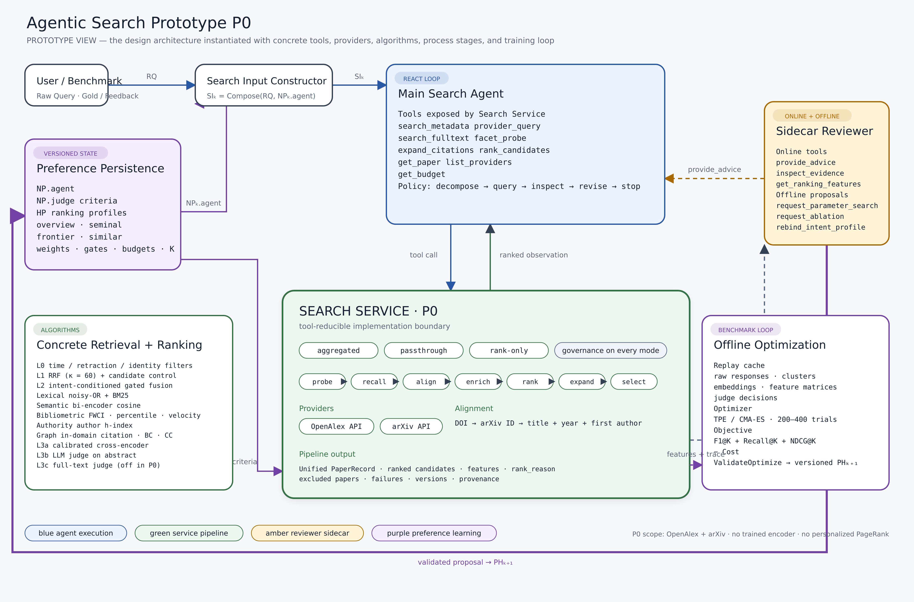

# 原型设计

> 状态：原型稿
> 项目：Agentic Search
> 关系：设计文档给概念、契约与约束；本文给可实现的具体方案

## 0. 本文的位置

三份上游文档只描述**行为抽象**：

| 文档 | 给什么 |
| --- | --- |
| `agentic_search_preference_reviewer_research_design.md` | 研究理念、可约简性判据、实验设计 |
| `design.md` | 系统契约、模块边界、两个时间尺度上的控制流 |
| `search-service.md` | 检索能力层的接口、provider 抽象、rerank 的机制与边界 |

**本文是唯一指明具体事物的地方**：具体的数据源与端点、具体的排序算法与公式、
具体的特征清单、具体的工具名与签名、具体的指标与阈值、具体的参数初值。

上游文档若与本文冲突，以上游的概念与约束为准；本文只负责在这些约束下给出一个能跑的实例。
换掉本文的全部内容，上游文档应当依然成立——这是判断抽象是否做对的标准。

`experiments.md` 是本文的下游：它规划待检验的命题、消融轴与等算力协议。
本文 §6.5 定义的 B / E / J / P 四条轴由它统筹执行顺序，M 轴（在线拓扑）在那里定义。

`skill-decomposition.md` 是本文 §7.3 的穷尽版：
它把参照实现 MetaScientist 的 skill 文本逐条拆到本架构的各层，
是 $NP_0^{agent}$ 条目列表与 $HP_0$ 初值的直接来源。

排序算法主要提炼自两处：`metascientist-rerank-design.md`（从另一项目的 CiteFlow 实现提炼），
以及 BIR（Bibliometric-enhanced Information Retrieval）方向的公开工作。
评价协议提炼自 AstaBench / PaperFindingBench 的实现
（`references/repos/asta-bench`，commit `5c844b7`，Apache-2.0）。
Main Search Agent 的策略先验初值提炼自同一项目的 citeflow skill，见 §7.3。

证据标记：**[实测]** 对真实 API 的探测结果；**[设计]** 本文的设计决策；
**[待验证]** 需要实验、标注集或额外资质才能定论。

---

## 1. 原型 P0 的范围

**接入**：OpenAlex（主源）、arXiv（补充源）、OpenCitations（引文边的补充/兜底源），
其余一律不做。三者的角色分派见 §2.1，降级链机制见 `search-service.md` §3.4。
**调用模式**：aggregated、passthrough、rank-only 三种全部提供——
passthrough 是验证 provider 抽象是否成立的关键，不能省。
**rerank**：L0–L2 全部实现；L3a（cross-encoder）与 L3b（LLM judge on abstract）实现；
L3c（全文判别）留接口默认关闭。
**训练**：模式 A（无梯度权重搜索）+ 意图条件化 profile。
**不做**：模式 B/C、judge 蒸馏、多 benchmark 聚合、personalized PageRank。

Semantic Scholar 暂不纳入：无 key 时只有 `/search/bulk` 与 `/{id}/citations` 稳定可用，
其余端点持续 429，申请周期不可控。**[实测]** 代价见 §10.1。



上图是 P0 的**原型视图**：`design.md` 的架构被落到具体的工具名、provider、算法与训练环上。
蓝色为 Agent 执行、绿色为 Service 管线、琥珀为 Reviewer 旁路、紫色为偏好学习环。
图中每一项都在后文展开：数据源见 §2、排序算法见 §3、LLM 判别见 §4、训练见 §5、工具集见 §7。

---

## 2. 数据源实例化

### 2.1 两个 provider 的能力声明 **[实测]**

| 能力 | OpenAlex | arXiv |
| --- | --- | --- |
| `search.keyword` | ✔ `title_and_abstract.search` | ✔ 但为宽松 OR 匹配，top-10 会混入离题结果 |
| `search.native_query` | ✔ `filter` 任意字段布尔组合 | ✔ 字段前缀 `ti`/`abs`/`au`/`cat` + AND/OR/ANDNOT |
| `search.field_filter` | ✔ | ✔ 含 `submittedDate` 范围 |
| `facet.group_by` | ✔ 单次返回全量分布 | ✘ |
| `id.lookup` | ✔ 免费不限次 | ✔ |
| `graph.references` | ✔ `referenced_works` | ✘ |
| `graph.citations` | ✔ `filter=cites:<id>` 反查 | ✘ |
| `metrics.raw_citations` | ✔ | ✘ |
| `metrics.normalized` | ✔ `fwci`、`citation_normalized_percentile` | ✘ |
| `text.abstract` | ✔ 倒排索引需重建 | ✔ `summary`，作者原文 |
| `text.fulltext` | 部分 | ✔ PDF |

**角色**：OpenAlex 是主召回与计量指标的主源；
arXiv 是时效与版本、作者自报 category、精确摘要、`comment` 中 venue 信号的补全源，
**不做主召回**；OpenCitations 只在引文边这一项能力上作为补充/兜底源，
不参与召回、不提供计量指标、不提供文本。

#### OpenCitations 的角色与待测项 **[待验证]**

引文边是本原型对 OpenAlex 依赖最重、也最脆弱的一环：§2.2 实测 preprint 的
`referenced_works` 覆盖仅 39%，而 §3.4 的领域内引用集中度、BC/CC 全部建立在这些边上。
边缺失时特征不是变差，是**整族缺失**——这正是需要一个独立来源的原因。

选它而不选 Semantic Scholar 的理由：它以 DOI 为主键、无需申请即可访问，
不存在 §1 记录的 S2 那种"申请周期不可控 + 端点持续 429"的问题。
它与 OpenAlex 的生成机制不同（基于 Crossref 存缴的开放引用 vs OpenAlex 自建索引），
因此两者的缺失大概率不同源——这是补充源有价值的前提，也是必须实测的第一件事。

接入前必须测的四项，任一不达标即退回两源方案：

```text
1. 边覆盖增量   OpenAlex 缺边的样本里，OpenCitations 能补上多少
2. 重叠一致性   两者都有边时的一致率；系统性分歧意味着主键或版本合并有误
3. preprint 覆盖 §2.2 的 39% 缺口是否被实质改善——这是接它的主要动机
4. 限流与延迟   无 token 时的实际速率上限，以及它对 expand 阶段延迟的影响
```

**主键风险**：OpenCitations 以 DOI 为中心，而 §2.2 已记录部分 arXiv DOI 会被
OpenAlex 从 works 主键降级（`10.48550/arxiv.1706.03762` 返回 404）。
无 DOI 或 DOI 不被识别的记录**拿不到任何 OpenCitations 边**，
因此它只能是补充源，不能替代 OpenAlex 作为图能力的主源。

**评价上的强制要求**：接入前后必须分别报告图特征的缺失率与 B4 结果。
补上的边若只改善覆盖而不改善排序（E3 对 E2），按 §6.5 E 轴的四种组合处置，
不得只看 top-K 就判定接入无效。

### 2.2 合并主键与字段路由 **[实测]**

主键优先级：

```text
1. 正式 DOI                          OpenAlex 覆盖约 98%
2. arXiv ID ↔ 10.48550/arXiv.<id>    确定性 join key，但需允许失败
3. 归一化标题 + 年份 + 首作者        兜底
```

第 2 级基于 arXiv 为每篇预印本分配的 DataCite DOI，OpenAlex 可直接解析；
但部分 arXiv DOI 会被 OpenAlex 从 works 主键降级为 location（实测
`10.48550/arxiv.1706.03762` 返回 404），必须回退到第 3 级。
arXiv API 自身只有约 3% 记录带 `arxiv:doi`（发表后回填的期刊 DOI），不能依赖。

字段路由：

| 字段 | 取自 | 依据与风险 |
| --- | --- | --- |
| 领域归一化影响力 | OpenAlex `fwci` / `citation_normalized_percentile` | article 覆盖 100%、**preprint 覆盖 0%** |
| 原始被引数 | OpenAlex `cited_by_count` | article 可信；**preprint 系统性低估 2–16 倍** |
| 图出边 | OpenAlex `referenced_works` | article 覆盖 99%、preprint 仅 39% |
| 图入边 | OpenAlex `filter=cites:<id>` | $0.0001/次，比逐条取引用列表便宜 |
| 主题 | OpenAlex `topics`+`keywords` ⊕ arXiv `category` | 生成机制独立（模型预测 vs 作者自报），可投票 |
| 摘要 | preprint 取 arXiv `summary`（96%）；article 取 OpenAlex（71–77%） | article 摘要缺口 23–29% 当前无法补齐，置缺失位 |
| 时效与版本 | arXiv `published`/`updated`、v1/v2、`comment` | 严格时间边界的唯一可靠来源；27% 有 v2+，14% comment 含发表状态 |
| 机构 / 国别 | OpenAlex `authorships[].institutions`（ROR 87%、ORCID 99%） | 不在顶层 `institutions` 字段 |
| 质量红旗 | OpenAlex `is_retracted` | — |

`record_thinness` 标记：OpenAlex 的 preprint 记录常常机构全空、`referenced_works` 为 0、
arXiv category 丢失、topic 由分类器猜测（实测 score 0.36）。薄记录参与图特征时降权。

### 2.3 管线实例化

```text
(0) probe    OpenAlex group_by 年份/topic/机构           $0.0001/次
(1) recall   OpenAlex title_and_abstract.search 主召回    $0.001/次
             arXiv Atom 仅用于 ID/标题精确命中与时间窗补充
(2) align    §2.2 主键；preprint 与正式版归入同一 cluster，计量字段取 article 侧
(3) enrich   OpenAlex 单实体端点（免费）回填 fwci/percentile/counts_by_year/topics
             arXiv 补 category / 版本 / comment / 精确摘要
(4) rank     L0 → L1 RRF → L2 门控加权 → L3a/L3b（§3、§4）
(5) expand   OpenAlex 出边 + cites 反查，深度 1，扇出上限 20
             边缺失且有可用 DOI 时按 search-service.md §3.4 的降级链补 OpenCitations
(6) select   预算内截断
```

阶段 (2) 的 preprint–article 合并是本原型的关键补偿：预印本自身计量字段不可信，
但只要正式版在 OpenAlex 里，同一 cluster 就能拿到可信的 `fwci` 与引用数。**[设计]**

### 2.4 预算与限流 **[实测]**

| 源 | 约束 | 对原型的影响 |
| --- | --- | --- |
| OpenAlex `search` | $0.001/次，1k/天 | 主召回次数受控；`select=` 必用（响应可从 129KB 压到很小） |
| OpenAlex `filter` / `group_by` | $0.0001/次，10k/天 | 探查、结构化过滤、入边反查优先 |
| OpenAlex 单实体 | 免费不限次 | 富集与取边的主力 |
| OpenAlex 瞬时速率 | 余额充足时仍会 429 | 必须退避重试 |
| arXiv | 必须 https（http 返回 0 字节），间隔 ≥3s，单次 ≤2000 条 | 补全源，串行低频 |
| OpenCitations | 无需 key；实际速率上限与分页行为**待实测** | 仅在 OpenAlex 边缺失时触发，计入 expand 阶段预算 |

---

## 3. Rerank 算法

### 3.1 算法来源与取舍

BIR 有三种用法：固定计量排序、作为 Learning-to-Rank 特征、作为表示学习监督信号。
本原型取**第二类**：不训练 LLM，也不训练论文 embedding，只优化一个可解释的、
意图条件化的 bibliometric ranking policy。

代表工作：[Mayr & Mutschke](https://arxiv.org/abs/1309.7949)（BIR 概念）、
[CiteRank](https://arxiv.org/abs/physics/0612122)（PageRank + 年龄衰减，属第一类）、
[Who Should I Cite?](https://dl.acm.org/doi/10.1145/1871437.1871517)（第二类的早期先例）、
[SPECTER](https://aclanthology.org/2020.acl-main.207/) 与
[SciNCL](https://aclanthology.org/2022.emnlp-main.802/)（第三类，本原型不采用）。

### 3.2 词法：noisy-OR

把查询里的判别性术语按稀有度加权，多个独立术语共同命中时形成合取式增益：

$$
s_{\mathrm{lex}}(q,p) = 1 - \prod_{j \in M(q,p)} \big(1 - \rho_j\big)
$$

$M(q,p)$ 是论文命中的查询术语集，$\rho_j \in [0,1]$ 是术语稀有度权重。
它擅长解释方法名、数据集名、指标名这类精确命中，不单独承担语义召回。
另保留 BM25(title)、BM25(abstract) 两维作为对照与兜底。

### 3.3 语义：双层与校准

bi-encoder 余弦对全部候选计算，成本可忽略；cross-encoder 让模型同时读 query 与论文文本，
只对 L3a 范围计算：

$$
s_{\mathrm{sem}}(q,p) = \mathrm{Calibrate}_{v_c}\big(g_{v_m}(q, x_p)\big),
\qquad x_p = \mathrm{title}(p) + \text{". "} + \mathrm{abstract}(p)
$$

$v_m$ 是模型版本，$v_c$ 是校准版本。**校准函数必须离线固定**，
绝不能在每个请求的 batch 内做 min-max 重缩放——那样不同 batch 的分数不可比，
训练数据与线上分数也不可比。这是最容易踩的坑。**[设计]**

摘要缺失时允许退化为标题，但必须产生 `abstract_missing = 1` 并记入诊断：
标题-only 记录不能与完整摘要记录被当作同等强度的证据。

### 3.4 图：领域内引用集中度

**默认特征不是 PageRank。** 对候选集 $D$，令 $n_{\mathrm{dom}}(p)$ 为 $D$ 中论文对 $p$ 的引用数，
$c(p)$ 为总引用数：

$$
s_{\mathrm{dom}}(p) = n_{\mathrm{dom}}(p) \left(\frac{n_{\mathrm{dom}}(p)}{c(p)}\right)^2
$$

它识别"被当前主题论文集中引用"的工作，而不是全球高被引论文；平方项让局部集中度主导。
计算只需候选集内部的边，**不需要一跳邻居扩展**，成本远低于 PageRank。**[设计]**

$c(p)=0$ 或引文图缺失时记为缺失并置 `citation_graph_missing`，
不能把未观测到的领域引用当作真实的零分。

**文献耦合与共被引**。$R(p)$ 为参考文献集，$C(p)$ 为施引文献集，种子集 $S$ 为 L1 top-$m$：

$$
\mathrm{BC}(p_i, p_j) = \frac{|R(p_i) \cap R(p_j)|}{\sqrt{|R(p_i)|\,|R(p_j)|}},
\qquad
\mathrm{CC}(p_i, p_j) = \frac{|C(p_i) \cap C(p_j)|}{\sqrt{|C(p_i)|\,|C(p_j)|}}
$$

$$
\mathrm{CouplingToSeeds}(p) = \frac{1}{|S|} \sum_{s \in S} \mathrm{BC}(p, s)
$$

**personalized PageRank 不进 P0**。若将来启用，形式为带重启的随机游走，
重启分布由 L1 分数给出：

$$
\pi = \alpha v + (1-\alpha)\, P^\top \pi,
\qquad
v_p = \frac{\exp\big(s^{L1}_p / T\big)}{\sum_{p'} \exp\big(s^{L1}_{p'} / T\big)}
$$

且**必须是 personalized 而非全局版本**：全局 PageRank 在引文图上收敛到领域声望先验，
与 citation count 高度共线，加进特征只是把同一个信号数两遍。
启用与否由 §6.5 的 `B4 - in-domain` 消融决定。

### 3.5 计量：归一化与偏倚校正

**领域与年份归一化**。有 `fwci` 时直接用；preprint 没有，用分组基线：

$$
\widetilde{c}(p) = \frac{\log\big(1 + c(p)\big) - \mu_{\mathrm{topic}(p),\,\mathrm{year}(p)}}{\sigma_{\mathrm{topic}(p),\,\mathrm{year}(p)}}
$$

$\mu, \sigma$ 由 OpenAlex `group_by` 在 (topic, year) 分组上估计并缓存。**[待验证]**

**引用速度**，区分"正在起势"与"吃老本"：

$$
\mathrm{Velocity}(p) = \frac{c_{Y} - c_{Y-2}}{2\,\big(1 + \bar{c}(p)\big)},
\qquad \bar{c}(p) = \frac{c(p)}{\max(1,\ Y - \mathrm{year}(p) + 1)}
$$

分母做平均年被引归一，避免高引老论文靠绝对增量取胜。

**时效相对请求的时间边界计算，不读机器当前时间**：

$$
s_{\mathrm{rec}}(p \mid e) = \mathrm{Recency}\big(\mathrm{year}(p),\ \mathrm{year}(e)\big)
$$

否则同一份历史截面在不同日期重跑会得到不同排序，离线评测无法复现。

**计量数据会坏**。实测存在 OpenAlex 引文链接从某年起大面积断裂的记录
（某篇 2017 年论文被标为 `publication_year: 2025`、`type: preprint`，
`counts_by_year` 从 2991 掉到 178，而 `filter=cites:` 反查得 6,620）。
逐年被引出现断崖式下跌且与反查计数不符时，bibliometric 族降权并置 `citation_confidence=low`。

**preprint 计量缺失的三条对策**，按优先级：

1. 走 §2.3 阶段 (2) 的 cluster 合并，用正式版记录的计量字段；
2. 合并失败则 bibliometric 族全部置缺失（不是置 0），由指示位承载
   "这是一篇计量信息不可用的新文献"；
3. 排序不因此惩罚它——lexical、semantic、constraint 三族仍然完整可用。

后果是**预印本的排序几乎完全由文本相关性决定**。对 `frontier` 意图这可接受甚至是想要的；
对 `seminal` / 影响力类意图是明显缺口。**[设计]**

### 3.6 名次融合与最终打分

**L1 名次融合**。跨源相关性分数量纲不可比，融合发生在名次层：

$$
\mathrm{RRF}(p) = \sum_{s \in \mathcal{S}} \frac{\omega_s}{\kappa + \mathrm{rank}_s(p)}
$$

$\mathcal{S}$ 是源与子查询的笛卡尔积，$\kappa$ 取 60 起步，$\omega_s$ 为源权重。

**L2 最终打分**：门控 + 乘法交互 + 意图加权。

$$
\mathrm{Score}_\theta(p \mid q, z)
= G_{\mathrm{rel}}(q, p) \cdot
\Big( w_{z,\mathrm{rel}}\, h_{\mathrm{rel}}(q,p)
+ \sum_{j \ne \mathrm{rel}} w_{z,j}\, f_j(q, p) \Big)
$$

$$
h_{\mathrm{rel}} =
\big(1 + \lambda_{\mathrm{lex}} s_{\mathrm{lex}}\big)
\big(1 + \lambda_{\mathrm{sem}} s_{\mathrm{sem}}\big)
\big(1 + \lambda_{\mathrm{jud}} s_{\mathrm{judge}}\big) - 1
$$

$$
G_{\mathrm{rel}}(q,p) = \sigma\!\big(\gamma_{\mathrm{rel}} \cdot (h_{\mathrm{rel}}(q,p) - \tau_{\mathrm{rel}})\big)
$$

三个设计点：**乘性门控**保证文本相关性不过关时任何计量加成都救不回来
（$\mathrm{Popularity} \neq \mathrm{Relevance}$，见
[Using Prior Information Derived from Citations](https://dl.acm.org/doi/10.5555/1931390.1931454)）；
**乘法交互**让多路证据同时命中获得协同增益；**意图条件化权重** $w_{z,j}$ 而非全局 $w_j$。

未触发的档位取 $s=0$，对应因子退化为 1，公式对档位缺失是连续的——
同一组权重在三种预算档下都能用，不需要为每档单独训练。**[设计]**

四个意图 profile 的初值：

```yaml
ranking_profiles:
  overview:                     # 领域综述：强调相关性、耦合、多样性
    semantic: 0.30
    coupling: 0.25
    in_domain: 0.15
    citation_percentile: 0.15
    recency: 0.10
    author_h: 0.05
  seminal:                      # 奠基性工作：强调影响力与共被引
    citation_percentile: 0.35
    co_citation: 0.25
    semantic: 0.25
    recency: 0.00
    author_h: 0.05
  frontier:                     # 前沿工作：强调时效与语义，压低共被引
    semantic: 0.40
    recency: 0.30
    coupling: 0.20
    citation_percentile: 0.05
    co_citation: 0.05
    author_h: 0.00
  similar:                      # 找相似论文：强调 BC/CC，压低全局引用
    coupling: 0.35
    co_citation: 0.25
    semantic: 0.30
    citation_percentile: 0.05
    recency: 0.05
```

数值是初值，最终由 §5 的搜索得到。

### 3.7 确定性排序与输出契约

```text
sort by (-final_score, -semantic_score, original_candidate_position)
```

同分时保持候选进入排序前的顺序。每条结果保留可归因的中间值：

```json
{
  "paper_id": "...", "rank": 1, "score": 0.83,
  "features": {"semantic_cross_encoder": 0.91, "lexical_noisy_or": 0.62,
               "judge_grade": 2, "in_domain_citation": 0.34,
               "citation_percentile": 0.48, "recency": 0.77},
  "rank_reason": ["semantic_match", "in_domain_citation"],
  "feature_missing": ["fwci"]
}
```

L0 排除的候选不静默丢弃：`excluded_papers: [{paper_id, reason}]`。

每次请求记录：`reranker_model`、`calibration_version`、`feature_version`、
`rubric_version`、`criteria_version`、`candidate_count`、`semantic_scored_count`、
`judged_count`、`cache_hits`、`api_calls`、`input_tokens`/`output_tokens`、
`cost_usd`、`elapsed_ms`、`failure_class`。

远程 cross-encoder 或 judge 失败时返回已计算的低成本特征排序，
在 `failures` 记录 `timeout` / `rate_limited` / `provider_error` / `invalid_response`；
不删候选，不无限重试。

### 3.8 特征清单

L1/L2 的 13 维，全部可从两源获得，零 LLM 成本：

| # | 特征 | 族 | 计算 |
| --- | --- | --- | --- |
| 1 | `lex_noisy_or` | lexical | §3.2 |
| 2 | `bm25_title` | lexical | 本地倒排 |
| 3 | `bm25_abstract` | lexical | 本地倒排 |
| 4 | `semantic_title` | semantic | bi-encoder 余弦，全候选 |
| 5 | `semantic_abstract` | semantic | bi-encoder 余弦，全候选 |
| 6 | `citation_percentile` | bibliometric | OpenAlex，缺失置 null + 指示位 |
| 7 | `fwci` | bibliometric | OpenAlex，preprint 缺失 |
| 8 | `citation_velocity` | bibliometric | §3.5 |
| 9 | `author_h_max` | bibliometric | 作者 h-index 最大值 |
| 10 | `in_domain_citation` | graph | §3.4，图族默认 |
| 11 | `coupling_to_seeds` | graph | BC 对 L1 top-$m$ 均值 |
| 12 | `co_citation_breadth` | graph | CC，依赖 `cites` 反查 |
| 13 | `recency` | constraint | 相对时间边界，§3.5 |

加缺失指示位 `abstract_missing`、`citation_graph_missing`、`fwci_missing`、
`velocity_missing`、`author_h_missing`、`coupling_missing`，共 13 + 6 = 19 维。
L3 触发时再加 `semantic_cross_encoder` 与 `judge_grade` 两维。

---

## 4. LLM 判别原型

### 4.1 三档与触发

```text
L3a  cross-encoder        N_sem   = 100    本地或小额远程；calibration_version 离线固定
L3b  LLM judge (abstract) N_judge = 30     temperature 0，结构化输出，按准则分级
L3c  LLM judge (fulltext) N_full  = 8      需先取 arXiv 全文；P0 默认关闭
```

默认策略：预算充裕走 L3a + L3b，紧张时只走 L3a，极紧张时全关退回 L2。
Agent 可显式指定档位；档位与实际执行数写入可观察状态。

### 4.2 加权准则制

判别不使用单一总分，而是对每条查询派生的带权准则逐条判断：

$$
\mathcal{C}_q = \big\{ (c, \mathrm{desc}_c, w_c) \big\},
\qquad
s_{\mathrm{judge}}(p) = \min\Big(1,\ \sum_{c \in \mathcal{C}_q} w_c \cdot \frac{r_c(p)}{3}\Big)
$$

$r_c(p) \in \{0,1,2,3\}$ 是论文对单条准则的相关档。合成分按切点
$0.25 / 0.67 / 0.99$ 离散回四档，与训练标签同构。

相比让模型直接给总分，三个好处：**可归因**（能指出哪条准则没满足）、
**可加权**（准则重要性不同）、**每条准则可独立要求证据**。

判别输入是 (查询准则, 单篇证据文本)，**没有同批其他候选**。输出：

```json
{"criteria": {
   "uses EMD as evaluation metric": {"relevance": "Perfectly Relevant",
     "snippet": "we used Earth Mover Distance (EMD) to compare ... attended objects"},
   "task is visual question answering": {"relevance": "Somewhat Relevant", "snippet": "..."}},
 "summary": "Uses EMD to compare attended objects against human judgement in VQA.",
 "rubric_version": "r3", "criteria_version": "cq_29_v2", "model_version": "..."}
```

三条实现约束：片段必须逐字复制且尽量短（≤20 词，必要时用 ` ... ` 拼接）；
准则缺项或解析失败则跳过该篇并计入 `failures`，不猜测、不重试到底；
准则文本与权重随 `criteria_version` 冻结，改准则等于换评测口径。

准则由 LLM 从查询生成，**只对约 1/5 的查询做人工校验**——
校验的是准则，不是逐篇判决，这比逐篇标注省得多。**[设计]**

### 4.3 判定缓存与确定性

判别输出按内容寻址缓存：

$$
\mathrm{key} = \mathrm{hash}\big(\mathrm{norm}(q),\ \mathrm{paper\_id},\ v_{\mathrm{text}},\ v_R,\ v_c,\ v_m\big)
$$

命中缓存时结果完全确定。这不是省钱的优化，而是训练的前提：
没有它，§5 的 200–400 次 trial 无法承受 LLM 成本。

judge 调用固定 temperature 0、固定 prompt 模板、结构化输出 schema；
provider 支持时固定 seed。残余非确定性用 Kendall $\tau$ 监控（§6.5）。

---

## 5. 训练原型

### 5.1 模式 A 配置

#### 前置步骤：参数分层与敏感性筛选 **[必做]**

搜索空间不能直接由"所有可调参数"构成。`skill-decomposition.md` 从参照实现里
拆出 33 个参数标记，加上本文 §3 的权重与门控，候选维度远超 200–400 trials 能覆盖的规模：
TPE 与 CMA-ES 在高维稀疏信号下会退化成随机搜索，而实验结论看不出这一点——
搜索"跑完了"，只是没搜到。

因此**每次重建搜索空间前必须先做一轮筛选**，把参数分成三层：

| 层 | 处置 | 判据 |
| --- | --- | --- |
| **可搜层** | 进 optimizer 的搜索空间 | 单参数扰动对目标 $J$ 的影响超过噪声带 |
| **固定层** | 冻结为常量，记入 $\theta$ 摘要 | 扰动影响落在噪声带内 |
| **边界层** | 只作为 $P.\mathrm{limits}$ 的安全上限，永不参与搜索 | 越界会破坏可比性或造成不可控成本（预算上限、`end_date`、并发） |

筛选协议：

```text
1. 基线      用默认取值跑 validation，重复 R 次，得到 J 的噪声带宽度
2. 单因子    每个候选参数取低/中/高三档，其余固定，测 |ΔJ|
3. 分层      |ΔJ| 超过噪声带 → 可搜层；否则 → 固定层
4. 交互抽查  对可搜层里语义相关的参数对（如 N_sem 与 N_judge）做一次二维扫描，
             确认没有把强交互项误判进固定层
5. 落盘      产出 screening_report：每个参数的层归属、|ΔJ|、判定依据、筛选时的数据切片
```

三条约束：

- **筛选用 validation，不用 held-out**。held-out 只在最终冻结后使用一次；
- **screening_report 必须版本化并与训练结果一同归档**。固定层的取值是实验条件的一部分，
  报告结果时不写明它，等于隐藏了一半的配置；
- **数据切片或特征族变化后必须重跑筛选**。参数的敏感性依赖于数据分布——
  接入 OpenCitations（§2.1）或改变意图分型都会使旧的分层失效。

筛选本身的算力计入训练预算，在等算力比较中不得漏记（`experiments.md` §5.1）。

#### 搜索配置

```text
optimizer     TPE (Optuna) 或 CMA-ES，200–400 trials
objective     J = 0.6·F1@K + 0.2·Recall@K + 0.2·NDCG@K - 0.02·Cost
search space  w_{z,j} ∈ [0,1] 单纯形约束；lambda_lex/sem/jud ∈ [0,3]
              gamma_rel ∈ [1,20]；tau_rel ∈ [0.2,0.8]；K ∈ {10,20,30,50}
              五个 N/K 分别搜索
data          训练集回放缓存（含 judge 判定缓存），不重打 API 也不重调 LLM
split         train / validation / held-out，held-out 冻结权重、rubric 与准则
```

目标函数中的 Recall 与 NDCG 按 §6 的口径定义（估计分母的 recall、下界校正的 nDCG），
否则训练目标与评测口径不一致。

$K$ 不是单一参数，至少拆成五个，只有最后一个决定答案集合大小：

```text
provider candidate N     每个源召回多少
fused candidate N        名次融合后保留多少
semantic candidate N_sem 进入 cross-encoder 的规模
judge candidate N_judge  进入 LLM 判别的规模
final output K           最终返回多少
```

### 5.2 回放数据集

judge 判定必须先落盘再训练：第一遍真实调用并缓存，之后全部 trial 在缓存上回放。
缓存键包含 query、时间边界、源版本、`feature_version`、`criteria_version`。

关掉网络仅凭回放缓存能重跑全部训练与消融，是本原型的硬性验收项（§9）。

### 5.3 标签构造

三档相关性由 benchmark gold 派生：gold 命中为 2，
gold 的直接引文邻居且通过约束检查为 1，其余召回为 0。**[设计]**

难负样本取"词项匹配分高但非 gold"的候选，比随机负样本更能逼出图特征与计量特征的价值。

---

## 6. 评价协议实例化

### 6.1 查询分型与指标分派

不要用一个指标覆盖所有查询：

| 类型 | 例子 | gold 可得性 | 指标 |
| --- | --- | --- | --- |
| navigational | "the AlphaGeometry paper" | 完整 | $\mathrm{F1} = \mathrm{HM}(\mathrm{precision}, \mathrm{recall})$ |
| metadata | "ACL 2024 中引用了 Transformer 的论文" | 完整（可用一段 API 代码完整求解） | 同上 |
| semantic | "用 EMD 作为评价指标的 VQA 论文" | **不完整** | §6.2–§6.3 |

参考实现中三型比例为 48 / 43 / 242，且**故意不告诉 agent 类型**——
检索 agent 本就应当自己路由。元数据类"每条查询配一段能完整求解它的代码"这一点值得学：
它把 gold 的构造变成可执行、可复核的对象，而不是一次性人工标注。

### 6.2 估计集合大小

语义类查询算得了精确率，算不了召回率——分母未知。硬凑"命中数"又是无界的。解法是估计分母：

$$
\hat{N}_q = \Big\lceil \big|G_q^{\mathrm{pool}}\big| \cdot \beta\big(|G_q^{\mathrm{pool}}|\big) \Big\rceil,
\qquad \beta \in [2, 10]
$$

$G_q^{\mathrm{pool}}$ 是用多组宽松配置跑同一系统、取结果并集得到的候选池；
$\beta$ 随池子变小而变大。然后计算 $\mathrm{recall}@\hat{N}_q$，即 $\mathrm{recall@}R$ 的估计版本。
这同时达成两件事：把分数 bound 在 $[0,1]$，并惩罚"多交就多得"的垃圾提交。

**候选池必须由与被评系统不同的配置生成**，否则分母被自己的偏好污染。**[Risk]**

### 6.3 下界校正 nDCG

排序质量不用精确率而用 nDCG，且是下界校正版——把"最坏排列"作为零点：

$$
\widetilde{\mathrm{nDCG}}(\mathbf{r})
= \frac{\mathrm{DCG}(\mathbf{r}) - \mathrm{DCG}\big(\mathrm{sort}_{\uparrow}(\mathbf{r})\big)}
{\mathrm{DCG}\big(\mathrm{sort}_{\downarrow}(\mathbf{r})\big) - \mathrm{DCG}\big(\mathrm{sort}_{\uparrow}(\mathbf{r})\big)},
\qquad
\mathrm{DCG}(\mathbf{r}) = \sum_{i \ge 1} \frac{r_i}{\log(i+1)}
$$

分母为 0 时记 0。标准 nDCG 在"返回的全都相关"时恒为 1，没有区分度；
减去最坏排列的 DCG 之后，衡量的才是这个排序相对于同一集合最差摆法好了多少。

单条查询的分数是两者的调和平均，任一项为 0 则整体为 0：

$$
\mathrm{score}_q = \mathrm{HM}\big(\widetilde{\mathrm{nDCG}},\ \mathrm{recall}@\hat{N}_q\big)
$$

全数据集分数是各查询分数的算术平均，不按类型加权——类型混合本身就是要考察的能力。

### 6.4 五条工程约束

1. **逐篇独立判断**，判别输入不含同批其他候选。
2. **证据随结果提交**：agent 必须交 verbatim 片段，判别只看这段而不看全文。
   理由是"评的是检索能力，不是判别模型的长上下文能力"。
3. **判定缓存与增量写回**：已判过的 (查询, 论文) 复用，已知为真的直接置满分不调模型。
4. **judge 失败不惩罚被评方**：单篇失败就跳过该篇，且先判全部再取 top-k。
5. **时间边界分桶而非静默丢弃**：越界结果分成"有效且在期内 / 有效但日期不符 / 无效 ID"
   三桶分别计数；同时对提交数量设硬上限（参考实现为 250 篇）防止暴力提交。

### 6.5 消融矩阵

排序器轴：

| 实验 | 排序器 |
| --- | --- |
| B0 | 词法/语义检索，无计量信号 |
| B1 | B0 + 固定 citation count |
| B2 | B0 + 固定完整计量公式 |
| B3 | B0 + 全局可训练权重 |
| B4 | B0 + intent-conditioned 可训练权重 |
| B5 | B4 + Reviewer 提案 / 验证 |
| B6 | LambdaMART bibliometric reranker |
| B7 | citation-informed embedding / reranker（上界参照） |

精排档位轴，与上表交叉：

```text
J0  无精排（仅 L1 + L2 廉价特征）
J1  + cross-encoder (L3a)
J2  + LLM judge on abstract (L3b)
J3  + LLM judge on full text (L3c)
J2' judge 蒸馏后的 L2 打分器（线上不调 judge）
```

扩展轴 E，与排序器轴交叉：

| 实验 | 引文扩展 |
| --- | --- |
| E0 | 不做扩展（仅检索召回） |
| E1 | 后向扩展（references + 共被引） |
| E2 | E1 + 前向扩展（citations） |
| E3 | E2 + OpenCitations 补边（§2.1） |

E 轴检验一条来自参照实现的负面经验：**候选覆盖的增益不等于排序的增益**。
MetaScientist 的 citeflow skill 记录，前向扩展至今未设为默认阶段，
理由是"更大的 store 本身不改善 top-K，前向扩展曾把已找到的相关论文压到 rank 100 之后"
（`skill-decomposition.md` CF-S-09、CF-F-01）。这是别人已经踩过的坑，
而本项目有 held-out 评测可以证伪它。

因此 E 轴的每一格**必须同时报告两个量**：候选集内的 gold 覆盖率（召回上界）
与最终 top-K 指标。四种组合分别对应不同处置：

```text
覆盖↑ 排序↑    扩展有效，设为默认
覆盖↑ 排序↓    复现了参照实现的负面结果 → 扩展保留但需门控，且必须报告门控条件
覆盖↑ 排序≈    扩展是排序器的负担而非收益 → 查是不是特征稀释或候选噪声
覆盖≈          扩展本身无效，与排序无关
```

第二种情形若出现，**不得只报告 top-K 下降就关闭扩展**：
覆盖率提高而排序变差，说明问题在排序器而不在扩展，
此时应记录为排序器的容量缺口，进 §10.2。**[待验证]**

偏好来源轴，与上两表交叉：

| 实验 | $NP_0^{agent}$ | $k$ 尺度更新 |
| --- | --- | --- |
| P0 | 最小指令（仅任务描述与输出格式） | 关闭 |
| P1 | 专家先验拆解版（§7.3） | 关闭（冻结） |
| P2 | 最小指令 | 开启 |
| P3 | 专家先验拆解版 | 开启 |

P1 是**人类专家基线**，也是本项目最强的对照组：

```text
P2 - P1   学出来的偏好能否达到人工撰写的水平
P3 - P1   在专家先验之上，Reviewer 是否还有剩余增益
P3 - P2   初值是否决定终点（NP_k 的收敛是否路径依赖）
```

若 P2 与 P3 均不优于 P1，本项目「策略先验应当被学习而非被撰写」的主张不成立。
这是预先声明的可证伪点，不得在实验后改换口径。**[待验证]**

关键消融：

```text
B4 - BC            文献耦合有没有用
B4 - CC            共被引有没有用
B4 - in-domain     领域内引用集中度有没有用（决定是否升级到 PPR）
B4 - Citation      计量信号整体有没有用
B4 - Recency
B4 - Author H
B4 - Reviewer      Reviewer 是否比纯数值优化器多提供价值
B4 - Persistent HP 持久偏好是否能跨 query / 跨 benchmark 泛化
J2 - criteria      换成通用准则，判别标准的学习是否真的有增益
```

除排序质量外必须报告：rerank 延迟与端到端延迟分开；cross-encoder 与 judge 的调用数、
缓存命中率、费用；摘要缺失率与图特征缺失率；judge 失败与降级后的分数；
新论文与经典论文分桶结果；按意图分层结果；重复调用的 Kendall $\tau$；
**候选覆盖与最终排序分开报告**——论文没进候选集时排序器无法补救该召回错误。

**judge 的两个特殊要求**：必须报告 judge-free 消融（J0/J1 对 J2/J3），
因为若 benchmark 的 gold 由 LLM 生成或校验，用 LLM judge 排序会系统性虚高；
必须报告准则集的人工校验比例与修正幅度。**[Risk]**

---

## 7. Agent 工具

设计文档只描述行为抽象，此处给出具体工具名与签名。

### 7.1 Main Search Agent 的工具集 $T^M$

| 工具 | 签名要点 | 说明 |
| --- | --- | --- |
| `search_metadata` | `(query, subqueries?, intent?, top_k, judge_level?)` | 主检索，返回排序候选 |
| `search_fulltext` | `(query, paper_ids?, sections?)` | 带全文证据的检索 |
| `provider_query` | `(provider, raw, normalize?)` | passthrough，原生检索式 |
| `facet_probe` | `(query, group_by)` | 召回前的分布勘察 |
| `expand_citations` | `(seed_ids, direction, depth)` | 引文扩展，深度与扇出有界 |
| `rank_candidates` | `(query, candidates, profile?)` | rank-only，不产生新召回 |
| `get_paper` | `(paper_id)` | 单篇详情 |
| `list_providers` | `()` | 能力表与配额余量 |
| `get_budget` | `()` | 预算余额 |

`judge_level` 取 `off` / `auto` / `l3a` / `l3b` / `l3c`。
**决定花多少预算做判别是 Agent 的策略，执行判别是 Service 的实现**——
这是 `judge_level` 出现在签名里、而模型与 prompt 不出现的原因。

`list_providers` 是 `provider_query` 可用的前提：Agent 得先知道有哪些源、
各自支持什么语法、还剩多少配额，才谈得上自己写检索式。

#### provider 语法的载体：运行时能力表，不是静态文本

各 provider 的原生检索语法（OpenAlex 的 `filter` 字段与布尔语法糖、
arXiv 的字段前缀与逻辑算符）**由 `list_providers` 在运行时返回，
不写进工具描述，也不写进 skill 文件**。三条理由：

1. **只有它能随 $\theta^S_k$ 收窄**。§3 要求 $T^M$ 是依据 $\theta^S_k$ 生成的受约束工具视图。
   静态文本做不到同步：$\theta$ 禁用了某个字段或收窄了时间窗，静态语法表还在教 Agent 用它，
   Agent 会写出必被运行时拒绝的检索式，白费 step。
2. **成本发生在需要的时候**。OpenAlex 的完整 filter 语法是千 token 量级，
   而一个 episode 内通常只写 1–2 次原生检索式；按 provider 裁剪后的能力表是百 token 量级，
   且只在 Agent 主动探查时付一次。
3. **不污染被观测量**。passthrough 存在的理由是观察 Agent 能否构造精确检索式
   （`search-service.md` §2）。若要求 Agent 先查阅一份 skill 文档，
   "没写出好检索式"就有了两个无法分离的原因——不会构造，或没想起来查文档。
   前置探查是接口契约而非策略判断，因此可以由运行时强制，不与"策略归 Agent"冲突。

由此确定三条接口约定：

- `provider_query` 的工具描述只写职责与前置条件，不含语法规格；
- `list_providers(provider?)` 返回语法规格、**当前 $\theta^S_k$ 下实际可用的字段子集**、
  配额余量与 1–2 条合法检索式样例；
- 语法拒绝必须返回可操作诊断（哪个字段在当前配置下不可用、去哪里查），
  并记入 $\bar{\tau}_t$——Reviewer 需要据此区分 Agent 是在试探边界还是在乱写。

`provider_query` 保持单一工具、provider 作枚举参数，不按数据源拆成
`openalex_query` / `arxiv_query`：拆开会让新增一个源变成修改工具集，
而统一工具加能力表只需注册一条记录（§2.1）。

密钥、限流退避与配额记账全部封闭在 Service 内，Agent 不持有也不感知凭据。

### 7.2 Reviewer 的工具集 $T^R$

**在线通道**（episode 内，尺度 $t$）：

| 工具 | 签名要点 |
| --- | --- |
| `provide_advice` | `(action, target, instructions, evidence_ids, confidence, expected_effect, novelty_key)` |
| `inspect_evidence` | `(evidence_ids)`，只读 |
| `get_ranking_features` | `(paper_ids)`，只读，返回 `features` 与 `rank_reason` |

`provide_advice` 的 `action` 取自有限集合：`refine_query`、`add_source`、
`expand_citation`、`rerank`、`increase_diversity`、`check_constraint`、`stop`。

**离线通道**（拿到反馈 $F$ 之后才注册，尺度 $k$）：

| 工具 | 签名要点 | 改什么 |
| --- | --- | --- |
| `propose_preference_update` | `(scope, changes, evidence, hypothesis)` | 结构化偏好参数 |
| `propose_judge_criteria_edit` | `(criteria_diff, evidence, hypothesis)` | 判别准则的自然语言表述 |
| `request_parameter_search` | `(subspace, objective_override, slice, hypothesis)` | 触发一次有界参数搜索 |
| `request_ablation` | `(target, slice, hypothesis)` | 产出报告，不改配置 |
| `rebind_intent_profile` | `(intent, profile, evidence)` | 意图到参数组的绑定 |
| `set_judgement_policy` | `(level, trigger, budget_cap, evidence)` | 判别档位与触发条件 |

三条约束：

1. **返回提案与验证结果，不返回"已生效"**。统一走
   $\theta_{k+1} = \mathrm{ValidateOptimize}(\theta_k,\ \mathrm{Proposal}_R,\ D_{\mathrm{train}})$，
   验证不通过即拒绝，Reviewer 不能覆盖。
2. **必须携带 evidence 与 hypothesis**，evidence 需引用轨迹、输出或反馈中真实存在的标识符。
3. **held-out 阶段这六个工具不注册**——不是调用后无效，而是根本不可见。

`request_parameter_search` 提交的是**搜索子空间与目标函数偏置，不是参数数值**。
Reviewer 具备语义层面的归因能力，不具备数值求解能力；
让它出子空间、由优化器求解、由验证器决定是否持久化，能力边界与职责边界因此对齐。

工具集由系统设计者定义，**Reviewer 不能扩展它**。要让 Reviewer 更强就加工具，
那是人的决策，不是 Reviewer 的自主行为——这条保证架构不会自行膨胀。

### 7.3 $NP_0^{agent}$ 的初值来源

$NP_0^{agent}$ 不能是空串。Reviewer 的离线提案是对既有表述做归因与改写，
起点若无内容，前几轮提案等价于在噪声上做梯度。它也不宜由本文作者临时编写：
那样的先验没有来历，消融时无法说明基线代表什么。

原型取 `packages/metascientist/metasci-skills/skills/metasci-citeflow/` 作为来源。
选它的理由是同构而非相似——该 skill 的第一原则为 *tools execute, agent decides*，
四条设计原则为「方向覆盖优先于深度」「每次调用后先诊断再行动」「预算感知」
「按研究假设分解方向」，与 §7.1 划出的 Agent / Service 边界是同一条边界。
同目录下的 `metasci-deepsearch` 已标记 ARCHIVED（*fixed pipeline*）并被其取代，
说明该项目自身也在从固定管线走向 agent 决策；它停在「策略由人撰写」这一步，
而本项目要检验的正是这一步之后的事。

#### 约束一：以初值身份进入，不以规范身份进入

$NP_0^{agent}$ 必须注册为 $PH_0$ 的一部分：可被 `propose_preference_update` 改写、
随 $k$ 版本化、在回放中可还原。**不得落地为仓库里的静态 prompt 文件**——
那样它就不在 $PH_k$ 内，Reviewer 对它没有作用面，$k$ 尺度失去一半的作用对象，
系统退化为「固定策略 + 只提供在线建议的旁观者」。

#### 约束二：先拆分，再灌入

skill 文本是混合体，逐字灌进 $SI$ 会把本该被训练的数值与本该被封装的算法
藏进自然语言，使其不可枚举、不可 gate、不可冻结。按本架构分层拆解：

| skill 中的内容 | 归属 | 落点 |
| --- | --- | --- |
| 「推断隐含的研究方向」「方向覆盖优先于深度」「先诊断再行动」 | $NP_k^{agent}$ | 保留为自然语言 |
| 诊断判据（标题相关 $\ge 6/10$、合并结果 $\ge 30$、年份与被引分布） | $HP_k$ | 可训练阈值，§5.1 |
| 工具调用预算与分配（"6 calls maximum"） | $HP_k$ | 预算参数，§2.4 |
| 「S2 优先，语义召回更好」 | provider 能力表 | §2.1，可证伪的能力断言 |
| discriminative terms 的 1–10 稀有度打分 | Search Service | §3.2 的 $\rho_j$ |
| 相关性判定的准则与阈值 | judge 准则集 | §4.2 |

倒数第三行在 P0 无对应 provider（§1）。它仍按能力断言处理而非写入初值——
"哪个源的语义召回更好"应当由 §2.1 的能力表承载并被实测推翻，不应作为 Agent 的信念。

#### 约束三：phase 分期只能是建议顺序

citeflow 的四个 phase（查询分析与检索 → 共被引与后向扩展 → 前向扩展 → 打分排序）
写进 $NP_0^{agent}$ 时只能表述为默认推荐顺序，不能表述为必须遵守的流程。
写成硬约束等于把固定管线伪装成策略先验：$t$ 尺度的自主决策被抽空，
而消融时观察不到——所有实验组都会呈现同一条轨迹形状。

#### 落地形式

$NP_0^{agent}$ 只保留策略判断类条目，形式为可独立引用、可独立改写的条目列表：

```text
NP_agent_v0:
  - id: direction-coverage
    text: 一个研究问题通常跨越多个研究社区；先覆盖各个方向，再在单一方向上深入。
  - id: diagnose-before-act
    text: 每次检索返回后，先判断结果质量（主题贴合、年份分布、来源重合），再决定下一步动作。
  - id: infer-implicit-directions
    text: 若问题隐含了文本中未出现的相关研究方向，主动为其生成检索意图。
  - id: budget-priority
    text: 在预算内为动作排优先级，不要为穷尽选项而耗尽预算。
  - id: rewrite-on-failure
    text: 结果跑题、过窄或过宽时重写检索式，而不是重复同一检索式。
  - id: phase-order-hint
    text: 默认顺序为先检索、再引文扩展、最后重排；这是建议而非约束，可按诊断结果改变。
```

条目粒度即提案粒度：`propose_preference_update` 的 `changes` 以 `id` 为单位，
消融可逐条关闭，回放可定位到具体条目的具体版本。

#### 示例式条目

条目有陈述式与示例式两种形态，**都在 $PH_k$ 内**（`design.md` §6.1）。
示例式条目用于查询分解这类"说不清但演示得出来"的判断：

```text
  - id: decompose-example-cross-community
    kind: example
    origin: {source: metasci-citeflow/references/query-search.md, lines: "34-44",
             status: rephrased}
    text: |
      问题："能否借用 conformal prediction 的校准指标改进 machine unlearning 的评价？"
      分解：(machine unlearning, evaluation) / (conformal prediction, calibration)
           / (unlearning, benchmark) / (model editing, knowledge)
      要点：第四组不在原问题的字面里，是由假设隐含的相关社区推断出来的。
```

三条要求：

- **`kind` 显式区分**，因为示例的改写方式与陈述不同：陈述可以逐句修订，
  示例通常整条替换。`propose_preference_update` 需要据此选择操作；
- **`origin` 必带**：取自真实轨迹的哪个 episode、哪次调用，或标注为人工构造/改写。
  没有来源的示例在归因时无法判断它是否已被后续证据推翻；
- **计入 P 轴消融**：P0（最小指令）不含任何示例式条目，P1 含全部。
  否则 P2 − P1 测的就不是"学出来的偏好能否达到人工撰写的水平"。

$NP_0^{judge}$ 侧同理——§4.2 判别准则里的正反例与准则文本同属一个版本化对象，
其中 `skill-decomposition.md` CF-B-07 的"邻接社区过载"最适合以示例形态承载：
该判据的关键在于识别"术语重叠但引用社区不同"，陈述式表述很难让判别器稳定复现。

#### 许可证前置条件

沿用 `metascientist-rerank-design.md` §7 的结论：该参考目录未发现独立的
`LICENSE` 或 `NOTICE`。上表与条目列表是对策略思想的重述与重新分层，不是文本复制；
若要逐字复用 skill 原文，须先补齐上游仓库 URL、commit 与许可证。**[Risk]**

---

## 8. 模块与实施路线

```text
src/search_service/
  api/         # 路由：aggregated / passthrough / rank-only / propose
  providers/   # openalex.py / arxiv.py：适配器 + 能力表 + 成本模型 + 字段映射
  merge/       # 主键聚类、字段路由、质量标记
  enrich/      # 富集调度与预算门控
  features/    # 七族特征抽取，带 feature_version
  graph/       # 领域内引用集中度、BC/CC、可选的 personalized PageRank
  judge/       # cross-encoder 与 LLM judge，准则版本与判定缓存
  rank/        # L0–L3 编排、门控、意图 profile、确定性 tie-break
  training/    # 回放数据集、敏感性筛选、模式 A 搜索、消融脚本
  governance/  # 预算、限流退避、轨迹落盘、时间边界强制、提案验证
```

| 里程碑 | 内容 | 完成判据 |
| --- | --- | --- |
| M0 | HTTP 骨架 + OpenAlex 单源 + L0/L1 | `search_metadata` 端到端跑通，带预算与时间边界 |
| M1 | 两源聚合：主键合并、字段路由、preprint–article cluster | 合并正确率可人工核对；标题兜底触发率有统计 |
| M2 | 特征抽取 + 回放数据集 + 敏感性筛选 + 模式 A 训练 | `screening_report` 产出且搜索空间由它确定；一个 benchmark 上 B4 优于 B2 与 B0 |
| M3 | L3a/L3b 判别接入 | J1/J2 相对 J0 的增益与成本一并报告 |
| M4 | Reviewer 离线工具与提案验证闭环 | 提案可归因、可回滚，held-out 下工具不注册 |

M2 之前不接 Reviewer：没有稳定的可训练打分函数，
"Reviewer 调整了排序偏好"这句话在实验上无法与噪声区分。

---

## 9. 验收判据

| 项 | 判据 |
| --- | --- |
| 接口 | 三种调用模式端到端跑通；`list_providers` 返回真实配额余量 |
| passthrough | 原生检索式原样送达，且时间边界、预算记账、轨迹记录、证据边界四条治理规则全部生效 |
| 合并 | 人工抽样核对 cluster 正确率；标题兜底触发率有统计 |
| rerank | B4 优于 B2 与 B0，且按意图分层报告 |
| judge | J1/J2 相对 J0 的增益与成本一并报告；准则集在约 1/5 查询上经人工校验 |
| judge 边界 | `judge/` 不持有跨调用状态：打乱候选顺序重跑，逐篇分级不变 |
| 降级 | 断开 judge provider，服务仍返回 L2 排序并在 `failures` 记录，不静默丢候选 |
| 评价口径 | 分型报告：有完整 gold 用标准 F1，无 gold 用 $\mathrm{HM}(\widetilde{\mathrm{nDCG}}, \mathrm{recall}@\hat{N})$ |
| Reviewer 离线通道 | 提案不直接生效；held-out 下六个工具不出现在 $T^R$ |
| 可复现 | 关掉网络，仅凭回放缓存能重跑全部训练与消融 |

---

## 10. 缺口、未验证与风险

### 10.1 未接入第三方计量源的代价

| 失去的能力 | 影响 | 当前替代 |
| --- | --- | --- |
| 跨源 ID 枢纽 | 主键合并少一层兜底，标题匹配触发率上升 | arXiv DataCite DOI + 标题归一化 |
| 可信的 preprint 引用数 | 预印本计量特征整体不可用 | cluster 合并，否则置缺失（§3.5） |
| 实质性引用计数 | 无法区分实质引用与礼节引用 | 无 |
| 引用上下文与 intent | 无法做定向引文游走，失去一类高质量证据文本 | 无 |
| 一句话摘要 | 粗筛少一个低 token 字段 | 摘要截断 |
| 正交平行召回 | 召回集正交性下降 | 无 |

引用语义类特征已从 §3.8 的清单中**移除**而非留空位，避免训练出依赖不可得字段的模型。
接入新计量源时作为一次显式的 `feature_version` 升级处理。

OpenCitations（§2.1）**不改变上表任何一行**：它只补引文边，
不提供计量指标、引用上下文、引用 intent 或摘要，也不参与召回。
它针对的是另一个问题——`referenced_works` 在 preprint 上仅 39% 覆盖（§2.2），
即图特征整族缺失。两者不可互相替代。

### 10.2 未验证 **[待验证]**

- 标题归一化兜底的合并准确率；
- OpenAlex 语义/向量检索（$0.001/次）能否作为第二召回源；
- preprint 归一化基线（§3.5）的分组样本量下限与稳定性；
- "不同源排序偏倚方向相反"目前基于单个 query 的探测，跨学科稳定性未知；
- 相关性排序的 precision 尚未用标注集评估；
- 意图标签 $z$ 的来源：由 Main Agent 声明、由分类器判定、还是二者兼有；
- $\hat{N}_q$ 候选池的构造：用哪些配置、$\beta$ 的取值曲线、对被评系统的敏感性。

### 10.3 风险

- **图特征不划算**：若消融显示无独立增益，果断退回 L1+L2，
  而不是因为"算法看起来高级"保留它。
- **计量特征喧宾夺主**：训练数据不足时容易被学成主导权重，表现为"总是返回高引经典"。
  相关性门控是第一道防线，意图分层评估是第二道。
- **意图分类错误的连锁反应**：$z$ 判错等于用错一整套权重，需单独测量错误率与代价。
- **judge 让排序不再确定**：§4.3 的机制是必要的，残余非确定性仍需 Kendall $\tau$ 监控。
- **评测循环论证**：judge-free 消融不是可选项；估计分母的候选池不能由被评系统自己生成。
- **judge 悄悄长出状态**：为省钱做批量判别、让 judge 看到同批其他候选，
  它就获得了跨篇上下文。批量只允许作为**并发实现**，不允许作为**上下文共享**。
- **单一元数据源**：OpenAlex 成为计量与引文图的唯一来源，其数据缺陷无法交叉校验。
- **缓存与真实调用发散**：离线回放训练出的权重在线上遇到不同召回分布会失效，
  需定期用真实调用重建回放集并比较候选分布。

## Git 提交流程

本文件是原型设计，不代表已实现，也不自动提交 Git。
