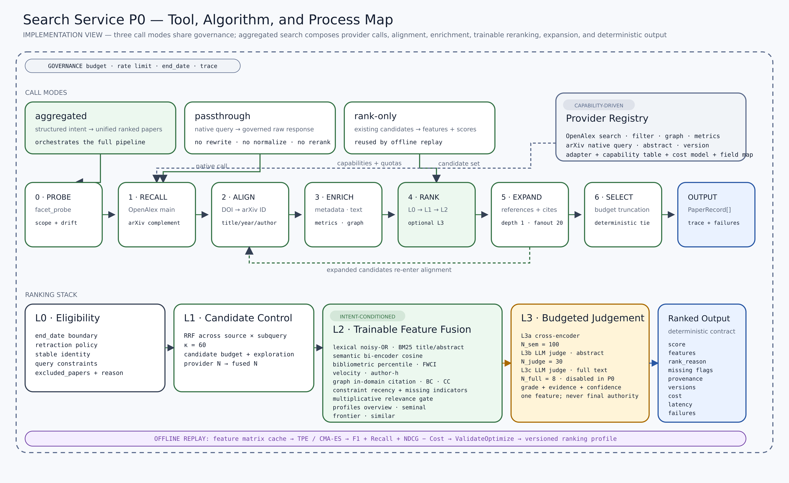

# Search Service 设计

> 子系统设计文档
> 项目：Agentic Search
> 状态：设计稿。只描述接口、机制与边界，不绑定任何具体数据源、算法或指标

## 0. 文档定位

上游契约来自 `design.md` §4；信息计量学信号的定位来自研究文档 §6.4：
h-index、共被引、文献耦合这些量**是排序特征，不是偏好本身**。

Search Service 的价值由两件事构成：

1. **可扩展的检索 API 接入**——既提供跨源聚合的统一检索，也提供任一 provider 的原样转发；
2. **可扩展、可训练的 rerank**——把信息计量学信号变成意图条件化的、能被 benchmark 优化的排序策略。

**本文不出现具体的数据源、算法公式、特征清单、指标定义与参数取值。**
这些属于 `prototype.md`。判据是：换掉原型的全部内容，本文应当依然成立。

---

## 1. 职责边界

在系统契约中，Search Service 是被 Main Agent 当作工具调用的 **tool-reducible 能力层**：

$$
o_t = \mathrm{SearchService}(u_t;\ \theta^S_k),
\qquad
\theta^S_k = \mathrm{Configure}(P,\ HP_k,\ NP_k^{\mathrm{judge}})
$$

**它负责**：provider 接入与转发、多源召回、跨源归一与去重、元数据与全文富集、
特征抽取、候选排序、引文扩展、预算与限流、可观察状态的生产，
以及承接离线提案的验证执行。

**它不负责**：任何需要**独立状态**的决策。查询理解、子查询分解、停止判断、
结果解释属于 Main Agent；覆盖缺口判断与建议属于 Reviewer；偏好的存储与版本管理属于
Preference Persistence。

边界画在"有没有独立状态"而**不是**"有没有语言模型"。Service 内部允许包含
无状态的语言模型判别器，只要每次调用的显式输入构成充分统计量、
不携带跨调用记忆、不做动作选择——判据见 §7.2。

两个实际后果：**排序策略可以被训练，但训练发生在离线，不在 episode 内**；
**智能计算可以发生在 Service 内，但它必须是 $y=f(x)$ 形态的 worker，而不是第二个决策主体**。



上图给出本文各节在 P0 上的一次落地：三种调用模式（§2）共享同一套治理，
aggregated 模式串起 probe → recall → align → enrich → rank → expand → select 的管线（§6），
分级排序栈 L0–L3（§7.5）产出确定性输出契约（§7.6），底部是离线回放与参数搜索（§7.7–§7.8）。
**图中的具体 provider、公式、特征与参数取值（OpenAlex/arXiv、RRF $\kappa=60$、$N$ 的取值等）
属于 `prototype.md` 的实例化，不构成本文的约束**；本文只约束模式、边界与机制本身。

---

## 2. 三种调用模式

只提供"打包好的聚合检索"是不够的。Main Agent 需要能自己写检索式——
这既是表达力问题，也是研究问题：如果 Service 把查询构造全部包办，
就无法观察 Agent 是否具备构造精确检索式的能力。

| 模式 | 输入 | Service 做什么 | Service 不做什么 |
| --- | --- | --- | --- |
| **aggregated** | 结构化检索意图 | 多 provider 召回、归一、富集、rerank、统一 schema | — |
| **passthrough** | 某 provider 的**原生检索式** | 鉴权、限流退避、预算记账、时间边界兜底、轨迹落盘 | 不改写查询、不归一、不 rerank |
| **rank-only** | 已有候选集 | 特征抽取与打分 | 不产生新召回 |

### 2.1 Passthrough：原样转发

各 provider 的原生查询语言表达力远超任何通用参数集——布尔组合、字段限定、
嵌套过滤、分面、排序键、翻页游标。把它们压扁成统一参数一定会丢东西。
因此 Service 必须允许 Agent 直接写 provider 方言。

passthrough 是能力出口，**不是治理的后门**。四条即使在此模式下也强制执行：**[设计]**

1. **时间边界**：provider 支持日期过滤就注入，不支持就在响应侧过滤。
   评测边界不是排序偏好，任何模式下都不能越界。
2. **预算与限流**：计入同一本账，共享退避策略。
3. **可观察性**：原生检索式与命中数写入可观察状态。
   Reviewer 必须能看到 Agent 到底问了什么，否则轨迹审查失去依据。
4. **证据边界**：未归一化的结果是原始响应，默认不进入证据集合；
   要作为候选参与后续排序，需显式请求 schema 映射。

归一化只做 schema 映射与 ID 对齐，仍然不做 rerank——
"我要原样的结果"和"我要它们被打分"是两个不同的请求。

### 2.2 三种模式的关系

```text
aggregated  = plan → [passthrough × N] → align → enrich → rank-only → select
passthrough = 一次 provider 调用 + 治理层
rank-only   = 特征抽取 + 打分
```

聚合检索不是第四种独立实现，而是前两者的编排。这个分解让三件事变简单：
新 provider 接入当天就能通过 passthrough 被使用；离线训练直接复用 rank-only；
消融实验可以只替换其中一段。

---

## 3. Provider 抽象

### 3.1 能力声明

管线**按能力编排，不按源名编排**。每个 provider 注册时声明一张能力表，
覆盖检索（关键词、原生检索式、字段过滤）、分面、ID 查找与映射、
引文图的出入边、计量指标、文本获取、推荐等维度，并附成本模型、
字段映射与可靠性档案。

管线阶段与能力的绑定关系是固定的：探查需要分面能力，主召回需要关键词检索，
富集需要 ID 查找，图特征需要引文边。没有 provider 提供某项能力时，
对应阶段**跳过并在可观察状态中标注**，而不是报错或静默降级。

### 3.2 接入一个新 provider 需要什么

四件事，缺一不可：适配器（原生请求/响应 ↔ 统一契约）、能力表、成本模型、字段映射。
**不需要**改动管线代码——这是"可扩展接入"的判据：
如果接一个源要改排序或合并的逻辑，说明抽象漏了。**[设计]**

### 3.3 字段级溯源

同一个字段可能有多个 provider 能给，取值规则由字段路由表决定（§5.2）。
每个字段保留溯源记录：取自哪个 provider 的哪个原始字段。
这既服务于审计，也服务于训练——特征的可用性统计直接来自这张溯源表。

---

## 4. 对外接口

| 能力 | 模式 | 用途 |
| --- | --- | --- |
| 元数据检索 | aggregated | 返回统一 schema 的排序候选，不含全文 |
| 全文检索 | aggregated | 带全文/段落证据，按需触发全文获取 |
| 原生查询转发 | passthrough | provider 方言直通（§2.1） |
| 候选重排 | rank-only | 对给定候选集打分，不产生新召回 |
| 引文扩展 | aggregated | 深度与扇出有界 |
| 分面勘察 | aggregated | 召回前的分布画像，需 provider 支持 |
| 单篇详情 | — | ID 回填与证据核对 |
| Provider 清单 | — | 能力表与配额余量，供 Agent 选择模式 |
| 预算查询 | — | episode 预算余额与各源用量 |
| **提案提交** | — | 承接 Reviewer 的离线更新提案（§7.9） |

Provider 清单是 passthrough 可用的前提：Agent 得先知道有哪些源、
各自支持什么语法、还剩多少配额，才谈得上自己写检索式。

请求必须显式携带 episode 上下文——查询、时间边界、预算、配置引用、
可选的意图标签与判别档位、轨迹标识——Service 不从全局状态推断。

响应返回统一 schema 加运行元数据：候选计数、被跳过的阶段、预算消耗、失败分类，
以及完整的版本溯源（排序器、特征、校准、判别准则、profile）。

对 Agent 而言 aggregated 模式的工具语义是"检索"，不是"调用哪个 API"；
但溯源信息必须完整保留。这两点不矛盾：**决策层不必见来源，审计层必须见来源。**

具体的 endpoint 命名、请求字段与工具签名见 `prototype.md` §7。

---

## 5. 数据模型

### 5.1 统一 Paper schema

按语义分组：identity（内部与外部标识、cluster）、bibliographic（题录与文本）、
bibliometric（计量原料）、graph（引文边）、quality（数据质量标记）、
provenance（字段级溯源）。

### 5.2 合并与字段路由

**合并主键**按确定性从高到低排列，逐级回退：全局唯一标识符 → provider 间的
确定性 join key → 外部 ID 映射 → 归一化题录字段。
每一级都要允许失败并回退，任何一级都不能假定 100% 命中。

**字段路由表**是一张"字段 × provider"的优先级表，取值规则由三件事决定：
覆盖率、可信度、以及**记录类型**。同一字段在不同记录类型下可能来自不同 provider——
这不是偏好问题，是事实问题。

**缺失与冲突都要显式表达**：缺失不填 0 而是置 null 并配缺失指示位（§7.4）；
多源冲突超过阈值时降低置信标记，冲突本身作为一维特征进入模型，
因为分歧往往意味着版本合并有误或存在重复条目。**[设计]**

---

## 6. 检索管线

aggregated 模式的编排，每一阶段都可因能力缺失或预算耗尽而跳过：

```text
(0) probe    分面勘察：判断查询是否过宽、领域边界在哪
(1) recall   主召回 + 正交补充召回；跨源相关性分数不可比，只保留名次
(2) align    主键聚类与合并；同一作品的多形态记录归入同一 cluster
(3) enrich   按需回填计量指标、主题、文本、图边；优先走免费或低成本端点
(4) rank     L0 过滤 → L1 名次融合 → L2 特征打分 → L3 精排三档（§7.5）
(5) expand   围绕高分候选做引文扩展，深度、扇出、总候选数有界，回流 (2)
(6) select   预算内截断，产出候选与可观察状态
```

三条贯穿性规则：

- **探查先行**。分面勘察的成本通常远低于一次全文检索，却能在召回前暴露语义漂移。
  把它作为默认动作，比事后靠 Reviewer 发现噪声便宜得多。**[设计]**
- **不做多路取并集**。不同源的召回集正交度高、排序偏倚方向不同，
  直接并集会把噪声一起放大；正确做法是一路主召回 + 多路补全，融合发生在名次层。
- **失败分类而非静默**。超时 / 限流 / 解析失败 / 空结果分别记账；
  超预算时停止当前策略并返回可解释的部分结果。

---

## 7. Rerank 的设计

### 7.1 定位：三种用法与本项目的选择

把信息计量学信号加入学术检索排序是一个有明确名字的研究方向——
**Bibliometric-enhanced Information Retrieval (BIR)**。它有三种彼此不能混谈的用法：

| 用法 | 训练什么 |
| --- | --- |
| 固定计量排序 | 通常不训练；权重人工设定时应称 heuristic bibliometric ranking |
| **作为 Learning-to-Rank 特征** | **排序权重 / 排序模型** |
| 作为表示学习监督信号 | 模型参数（文档编码器） |

**本项目选择第二类，并有意停在第二类。** 第三类要训练文档编码器，
与"冻结基础模型、只优化持久化检索偏好"的研究主张冲突；第一类无法回答
"权重从哪来"这个问题。代表工作与具体算法见 `prototype.md` §3。

需要立刻澄清一点：**"不训练 LLM"不等于"排序里没有 LLM"**。下一节处理这个区分。

### 7.2 排序中的智能计算：判据与分层

一旦排序要读摘要甚至全文、按标准给出分级判断，它就不再是纯数值计算。
因此不能先假定 rerank 是"无智能计算的算子"再把它塞进 Search Service——
必须先说清楚：**什么样的智能计算可以留在 Service 内，什么样的必须留在 Agent 那一侧。**

#### 判据

研究文档 §3.2 已经给出标准：模块行为可写成 $y=f(x)$ 或 $P(y \mid x)$，
且**一次调用的显式输入构成充分统计量**，即为 tool-reducible。
它还明确写了"内部复杂、含多次 LLM call，甚至内部有多个 worker，
都不自动否定 tool-reducibility"，并把 relevance judgement 列为 stateless worker、
candidate reranking 列为 tool / worker。

边界不是"有没有 LLM"，而是**有没有独立状态**。展开成三条可逐项检查的否定：

| # | 检查 | 通过的含义 |
| --- | --- | --- |
| 1 | 不读取本 episode 的历史 $H_t$ | 每次调用的输入自足，换个顺序调用结果不变 |
| 2 | 不携带跨 episode 的独立状态 $M_t$ | 判别标准是**传入的输入**，不是 worker 内部记忆 |
| 3 | 不做 action selection | 输出是分数/标签/理由，不是"下一步该做什么" |

三条全过 → **stateless worker**，可封装为 Service 的 rerank 能力，
不影响架构不可约简性的论证。任何一条不过 → 它是第二个决策主体，
必须留在 Main Agent 或 Reviewer 一侧，并按 Agent 计入架构论证。

#### 谁决定 vs 谁执行

> **决定是否升档、花多少预算做判别，是 Agent 的策略；
> 如何执行判别、如何缓存、如何记账、如何版本化，是 Service 的实现。**

Agent 在请求中携带判别档位与预算；Service 负责执行并如实记账。
Agent 不需要知道判别用了哪个模型、prompt 怎么写、结果是否命中缓存。

#### 三档精排

L3 不是一个档位，而是成本递增的三档，都满足上述判据：
判别式模型精排、基于摘要的语言模型判别、基于全文的语言模型判别。

三档共享同一个输出契约：分级 + 理由 + 置信度，作为**一维特征**参与融合，
而**不是**直接覆盖排序结果。让判别器直接决定最终顺序，
等于把前面所有可训练的权重作废。**[设计]**

档位选择由预算与 Agent 策略共同决定；跳档允许，但要记录。

### 7.3 打分的结构

$$
\mathrm{Score}_\theta(p \mid q, z)
= G_{\mathrm{rel}}(q, p) \cdot \sum_j w_{z,j}\, f_j(q, p)
$$

- $q$：查询；$z$：检索意图；$f_j$：特征；$w_{z,j}$：**意图 $z$ 下**的权重；
- $G_{\mathrm{rel}}$：相关性门控；$\theta$：全部可训练的排序偏好参数。

两个结构性决定：

**门控是乘性的，不是加性的。** 只把影响力先验加进排序，会把高影响力但与查询无关的
论文推到前面（$\mathrm{Popularity} \neq \mathrm{Relevance}$）。乘性门控保证：
文本相关性不过关，任何计量加成都不能把它救回来。

**权重按意图条件化，而不是全局一套。** 计量指标的有效方向依赖意图——
找综述时高引用是正信号，找最新方法时高引用往往意味着吃老本。
一套全局权重必然在一半查询上是错的。因此训练 $w_{z,j}$ 而不是 $w_j$。**[Core]**

意图 profile 以偏好的形式持久化；具体的特征形式、门控函数与 profile 初值见
`prototype.md` §3.6。

### 7.4 特征的组织

特征按族组织：lexical、semantic、judge、bibliometric、graph、consensus、constraint。
每一维的定义写进 `feature_version`，改定义必须升版本号，
否则历史训练数据与新模型不可比。

三条组织原则：

- **缺失值不填 0**。每个可能缺失的特征配一个缺失指示位，让模型学
  "没有这个证据"意味着什么。对计量字段缺失的新文献，这比补 0
  （等价于断言"影响力为零"）更诚实。
- **图信号是排序输入，不是过滤条件**。把图信号当阈值过滤器会在综述类查询上
  误杀跨簇的关键文献；阈值应由训练决定，硬阈值只保留在 L0 约束与扩展预算上限。
- **计量信号需要偏倚校正**。原始引用数对年代与领域有系统性偏倚；
  时效必须相对请求的时间边界而非机器当前时间计算，否则历史截面无法复现。

各特征的可训练性与风险评估、具体算法见 `prototype.md` §3。

### 7.5 分级流水线

| 级 | 名称 | 参数 | 成本 |
| --- | --- | --- | --- |
| L0 | 硬约束与可排序性检查 | 无（仅约束） | 0 |
| L1 | 低成本候选范围控制与名次融合 | 融合参数、进入精排的上限 | 0 |
| L2 | 特征计算与融合打分 | 权重、门控参数 | 本地计算 |
| L3a/b/c | 精排三档（§7.2） | 档位、判别准则版本 | 递增，预算门控 |

**L0 不产生偏好分数，只决定资格**：时间边界、撤稿策略、稳定标识符存在、
候选属于当前查询范围。被排除的候选不能静默丢弃，必须记录标识与原因。

**L1** 对全部候选计算零成本特征，并确定进入精排的上限——
它是预算参数，不是固定的全量候选数。名额优先给约束命中、多源共同命中、
低成本特征表现好的候选，另外留**少量探索配额**，
避免低成本预筛造成不可逆的召回损失。

跨源融合用名次而非分数：跨 provider 的相关性分数量纲不可比，
多数 provider 甚至不外露分数。

### 7.6 校准、确定性与可复现

引入判别式模型与语言模型判别之后，"同一输入同一配置产生同一排序"不再自动成立。
四条机制把它拿回来：**[设计]**

1. **版本钉死**。每次响应记录排序器、校准、特征、判别准则与 profile 的版本。
   任一变化都视为不同的排序器。
2. **判别结果按内容寻址缓存**。键包含归一化查询、论文标识、文本版本、
   准则版本、模型版本与校准版本。命中缓存时结果完全确定——
   这同时是离线训练回放的前提，没有它，用判别结果训练轻量排序器这条路走不通。
3. **采样受控**。固定温度、固定模板、结构化输出而非自由文本解析；
   残余非确定性用重复调用的排序稳定性指标监控。
4. **确定性排序与稳定 tie-break**。同分时保持候选进入排序前的顺序。

**校准函数必须离线固定**，不能在每个请求的 batch 内重新缩放——
否则不同 batch 的分数不可比，训练数据与线上分数也不可比。

**失败不静默**。远程判别失败时返回已计算的低成本特征排序，
按类记录失败原因；不删候选，不无限重试，不假装那一档跑过了。

### 7.7 四种训练模式

| 模式 | 方法 | 产出 | 适用阶段 |
| --- | --- | --- | --- |
| **A** 直接优化加权公式 | 无梯度搜索 | 一组权重 | **第一版** |
| **B** 监督式 Learning-to-Rank | pointwise / pairwise / listwise | 轻量排序模型 | 标注量上来之后 |
| **C** 在线偏好学习 | bandit 类方法 | 在线更新的策略 | 上线个性化，非本阶段 |
| **D** Reviewer 提议 + 优化器验证 | 归因 → 候选更新 → 回放验证 | 经验证的偏好更新 | 与双 Agent 结构配套 |

**模式 A** 训练的对象是 $PH_k \to PH_{k+1}$ 而非模型参数，不需要梯度，
不产生复杂模型，是第一版最合适的方案。

**模式 B** 采用之后，论文中的表述必须相应改为
"We do not fine-tune the LLM, but train a lightweight bibliometric reranker"，
而不能再说"没有训练任何模型"。**[Core：表述纪律]**
判别结果蒸馏是它的一条特殊数据通路：用昂贵判别的分级作为标签，
训练只用廉价特征的打分器，把智能计算转成一次性成本。
但必须警惕它继承判别器的偏倚，且**不能用同一批判别结果同时做训练和评测**。

**模式 C** 不适合第一阶段：反馈稀疏、位置偏差明显、探索会降低当前检索质量，
且难以与离线指标公平比较。

**模式 D 与本项目架构最契合**：

$$
\theta_{k+1} = \mathrm{ValidateOptimize}\big(\theta_k,\ \mathrm{Proposal}_R,\ D_{\mathrm{train}}\big)
$$

关键在于**最终数值不由 Reviewer 用语言直接决定**：
Reviewer 负责归因并提出搜索方向，优化器负责数值求解，验证器决定是否持久化。
这让 Reviewer 的贡献变成可测量的——它提出的方向是否比随机方向更快找到增益，
本身就是一个可做的消融。模式 D 同样适用于判别准则的修改。

### 7.8 训练目标的构成与 K 的拆分

目标函数必须与最终评价口径一致，并且**把成本与延迟写进目标函数本身**，
而不是当作事后约束——否则优化器一定会用预算换分数。引入语言模型判别之后这一点更关键：
成本项是唯一阻止优化器把所有候选都送去最贵档位的东西。

$$
J(\theta) = \underbrace{\alpha\,\mathrm{Quality}}_{\text{与评测口径同定义}}
\;-\; \underbrace{\lambda_c\,\mathrm{Cost} \;-\; \lambda_l\,\mathrm{Latency}}_{\text{预算项}}
$$

$K$ 本身可训练，但**不能把 topK 当成一个参数**。至少拆成五个：
每源召回量、融合后保留量、进入判别式精排的规模、进入语言模型判别的规模、
最终返回量。前四个是成本旋钮，第五个是精确率/召回率的权衡点，
混为一谈会让训练结果无法解释。

### 7.9 在线可调、离线训练，与判别准则的归属

| | 在线（episode 内，尺度 $t$） | 离线（尺度 $k$） |
| --- | --- | --- |
| 可变对象 | profile 选择、有界缩放、源开关、判别档位、五个 N/K | 权重、门控参数、判别准则、特征集合、模型与校准版本 |
| 谁触发 | Reviewer 的在线建议 | 训练管线 / 模式 D 的优化器 |
| 约束 | clamp 到有界区间 | schema 校验 + held-out 冻结 |
| 失败后果 | 单次检索质量下降，可回滚 | 模型漂移、测试集泄漏 |

在线的有界缩放叠加在训练好的权重上：

$$
w^{\mathrm{eff}}_{z,j} = w_{z,j} \cdot \mathrm{clamp}\big(\lambda_j,\ \lambda_{\min},\ \lambda_{\max}\big)
$$

#### 判别准则属于哪一半偏好

判别器的准则是自然语言，却作用于 Search Service。在原来
"$NP$ 给 Agent、$HP$ 给 Service"的划分下无处安放。正确的划分依据不是**给谁用**，
而是**表示形式与消费者类型**：$NP$ 由语言模型消费，$HP$ 由确定性代码消费。
Service 内部有了判别器之后，它也成了语言模型消费者，因此 $NP_k$ 分流：

$$
NP_k = \big\langle NP_k^{\mathrm{agent}},\ NP_k^{\mathrm{judge}} \big\rangle
$$

这对研究主张是加分项：Reviewer 现在能学两类东西——数值权重，
和**判别标准的自然语言表述**。后者是"冻结模型参数、只优化持久化偏好"的最纯粹形式：
可读、可 diff、可版本化、可由回放实验验证增益。数值权重变了难以向人解释，
准则变了一目了然。

约束与数值权重一致：准则属于离线更新，episode 内只读；每次修改产生新版本号；
判别缓存以准则版本为键的一部分，因此改准则会正确地使缓存失效。

#### 承接离线提案

Service 对外暴露提案入口，承接 Reviewer 的离线更新（研究文档 §7.3 的离线动作）。
三条约束：

1. **提案入口返回提案与验证结果，不返回"已生效"**。所有提案统一走
   $\mathrm{ValidateOptimize}$，验证不通过即拒绝，提案方不能覆盖。
2. **提案必须携带证据与假设**，证据需引用轨迹、输出或反馈中真实存在的标识符。
3. **held-out 阶段提案入口不对 Reviewer 注册**——不是调用后无效，而是根本不可见。

其中"触发参数搜索"类提案的语义需要精确：接受的是**搜索子空间与目标函数偏置**，
不是参数数值。提案方具备语义层面的归因能力，不具备数值求解能力。

**训练划分必须与研究文档 §7.1 一致**：排序参数与判别准则只能在 train split 上优化，
held-out 上冻结。否则 rerank 会成为一条绕过 Preference 冻结协议的测试集泄漏通道。

### 7.10 评价的原则

排序质量的评价有三条设计层面的要求，具体指标与公式见 `prototype.md` §6：

1. **按查询类型分派指标**。有完整 gold 的查询与无完整 gold 的查询不能用同一个指标，
   更不能把两种分数直接平均后当作单一战绩。
2. **无完整 gold 时，分母需要显式估计**，且估计用的候选池必须由**与被评系统不同的配置**
   生成——用自己的系统生成分母来评自己，是循环论证。**[Risk]**
3. **判别器参与排序时，必须报告不含判别器的对照**。如果评测的 gold 本身由语言模型
   生成或校验，用语言模型判别来排序会有系统性一致偏差，分数虚高。**[Risk]**

此外：训练目标里的质量项必须与评测口径同定义，否则优化的是一个并不据以评分的量；
候选覆盖必须与最终排序分开报告——论文没进候选集时，排序器无法补救该召回错误。

---

## 8. 预算、限流与缓存

**预算**是控制流的一部分，不是事后统计。请求携带预算，Service 在阶段边界检查余额，
超限时停止当前策略并返回可解释的部分结果，标注被跳过的阶段。
passthrough 与 aggregated 共享同一本账。

**限流**由 provider 的成本模型声明，Service 统一实现退避重试。
按日额度记账是不够的——瞬时速率限制会在额度充足时触发，客户端必须假定随时会被拒。

**缓存**分四层，键都包含时间边界与源版本：原始响应、合并后的 cluster、
稠密向量、特征矩阵。**特征矩阵缓存是离线训练回放的物理载体**：
训练与消融在缓存上回放，不重打 API。这一条同时解决成本、可复现、
以及"改了特征就要重跑全部 API"的问题。

---

## 9. 模块划分

按职责分层：路由与调用模式、provider 适配、合并与字段路由、富集调度、
特征抽取、图计算、判别、排序编排、训练与消融、治理。

两个模块的独立性是有意的：

- **治理层**同时服务于三种调用模式——passthrough 绕过的是归一化与排序，
  绝不能绕过治理。提案验证也归此层。
- **判别层**与排序编排分开，是为了让"智能计算"有一个可以被整体关闭、
  整体替换、整体计价的物理边界。它对外只暴露 $y=f(x)$ 形态的接口，
  不持有任何跨调用状态——这条约束若被打破，§7.2 的架构论证随之失效。

目录结构与具体模块名见 `prototype.md` §8。

---

## 10. 设计层面的开放问题

- **意图标签的来源**：由 Main Agent 声明、由分类器判定、还是二者兼有？
  意图条件化权重把它变成了单点故障——判错意图等于用错一整套权重。**[待验证]**
- **判别器与词法特征是否共线**：判别器可能对术语表面重合更宽容，
  与词法特征测的是同一个信号。需实测相关性。**[待验证]**
- **图信号是否值得其成本**：只有消融显示独立增益时才保留图计算。**[待验证]**
- **判别器悄悄长出状态**：一旦为了省钱做批量判别、让判别器看到同批其他候选，
  它就获得跨篇上下文，§7.2 的三条否定被打破。
  批量只允许作为**并发实现**，不允许作为**上下文共享**。**[Risk]**

## Git 提交流程

本文件是设计文档，不代表已实现，也不自动提交 Git。
