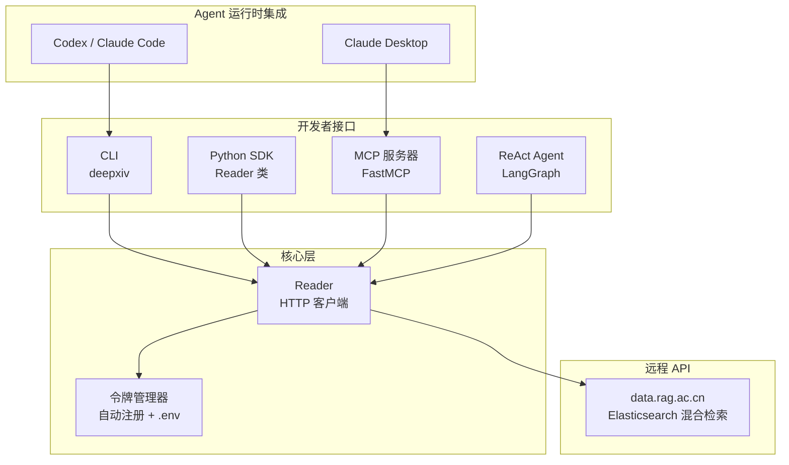
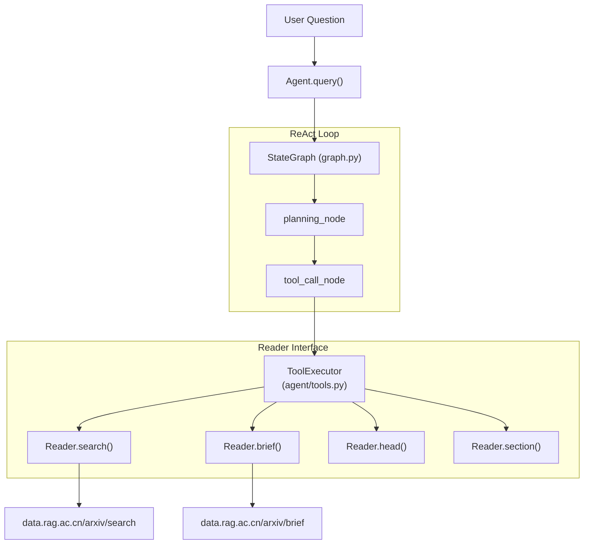
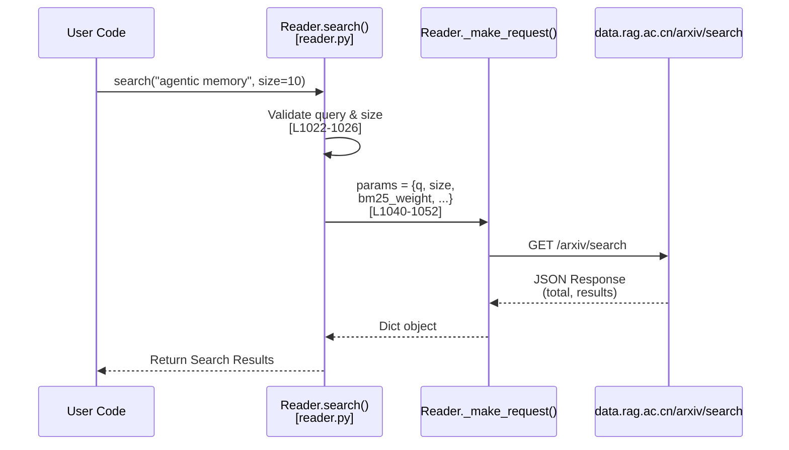

# DeepXiv SDK 项目概述

---
## 项目结构
该仓库采用扁平化布局，包含一个源码包、配套的示例脚本，以及一个包含可复用的提示词驱动工作流的 `skills/` 目录。

```
deepxiv_sdk/
├── __init__.py
├── reader.py              # 核心 API 客户端 — search、brief、head、section、raw、trending、PMC
├── cli.py                 # Click CLI 命令组 — search、paper、trending、agent、serve、config 等
├── mcp_server.py          # FastMCP 服务器，为 Claude / Codex Agent 暴露工具
└── agent/
    ├── agent.py           # 高层 Agent 类（LangGraph 编排）
    ├── graph.py           # ReAct 循环：call_llm → execute_tool → route → END
    ├── state.py           # TypedDict 状态：papers、messages、caches、轮次追踪
    ├── tools.py           # 工具定义 + ToolExecutor（search_papers、load_paper、read_section 等）
    └── prompts.py         # 研究助手角色的系统提示词

examples/                  # 可运行的 Python 脚本（quickstart、reader、agent、advanced 等）
skills/                    # SKILL.md 提示词文件，用于 trending-digest、baseline-table、cli
tests/                     # 带覆盖率的 pytest 测试套件（test_cli、test_reader、test_mcp_server 等）
```

---

## 架构概览
所有接口层——CLI、Python SDK、Agent、MCP——最终都通过 `Reader` 类进行流转，该类与 `https://data.rag.ac.cn` API 通信。Agent 层在此基础之上增加了 LangGraph ReAct 循环，而 MCP 服务器则将相同的功能作为可调用工具暴露给外部 AI 运行时。




用户请求在 Agent 状态机中的处理过程:


搜索请求pipeline:


---

## 核心设计理念：渐进式阅读
DeepXiv 围绕一个核心观察构建——Agent 不应加载完整的论文，除非真正需要。该 SDK 没有返回庞大的 PDF 或原始文本，而是提供了一个分层的内容 API，让你只需读取当前任务所需的足够信息，从而控制成本和上下文窗口的使用量。

每个渐进式阅读级别都会消耗可预测且有上限的 Token 数量：

| 层级 | CLI 标志 | SDK 方法 | 获取内容 | 预估 Token 数 |
|------|----------|----------|----------|---------------|
| Brief | `--brief` | `reader.brief(id)` | 标题、TLDR、关键词、引用、GitHub 链接 | ~500 |
| Head | `--head` | `reader.head(id)` | 元数据 + 章节列表（附带各章节摘要及 Token 计数） | ~1–2 k |
| Section | `--section Name` | `reader.section(id, name)` | 单个章节的全文 | ~1–10 k |
| Raw / Full | (默认) | `reader.raw(id)` | Markdown 格式的完整论文 | ~10–100 k |

**推荐的 Agent 工作流**是 **Brief → Head → Section**，仅查看最有价值的章节。这种三步漏斗机制使得 Agent 能够快速筛选数十篇论文，并将上下文预算花在刀刃上。

---
## 功能概览
DeepXiv 提供四个直接映射到 CLI 命令组的能力域：

| 能力 | CLI 命令 | 关键选项 | Python 等效方式 |
|------|----------|----------|-----------------|
| 论文检索 | `deepxiv search` | `--mode hybrid/bm25/vector`、`--categories`、`--date-from`、`--min-citations` | `reader.search()` |
| 渐进式阅读 | `deepxiv paper` | `--brief`、`--head`、`--section`、`--preview`、`--raw`、`--popularity` | `reader.brief()`、`.head()`、`.section()`、`.raw()` |
| 热门趋势 | `deepxiv trending` | `--days 7/14/30`、`--limit` | `reader.trending()` |
| 生物医学文献 | `deepxiv pmc` | `--head` | `reader.pmc_head()`、`.pmc_full()` |
| 网页检索 | `deepxiv wsearch` | `--json` | `reader.websearch()` |
| Semantic Scholar | `deepxiv sc` | `--json` | `reader.semantic_scholar()` |
| 内置 Agent | `deepxiv agent query` | `--verbose`、`--max-turn`、`--model` | `Agent.query()` |
| MCP 服务器 | `deepxiv serve` | `--transport stdio` | — |
| 令牌管理 | `deepxiv config` | `--global` | `ensure_token()` |

---

## 安装选项
该包提供三个依赖层级，按需安装即可：

| 安装命令 | 获取内容 | 适用场景 |
|----------|----------|----------|
| `pip install deepxiv-sdk` | CLI + Python SDK (Reader) | 脚本编写、流水线、基础检索与阅读 |
| `pip install deepxiv-sdk[mcp]` | + MCP 服务器 | Claude Desktop / Codex 集成 |
| `pip install deepxiv-sdk[all]` | + Agent（OpenAI + LangGraph） | 内置 ReAct Agent、全功能研究 |
| `pip install deepxiv-sdk[dev]` | + 测试/代码检查工具 | 参与 SDK 贡献 |

**零配置令牌**：在首次运行 CLI 时，DeepXiv 会通过 `POST /api/register/sdk` 自动注册一个免费的匿名令牌，并将其持久化存储到 `~/.env` 中。匿名令牌每天可获得 1,000 积分（大多数请求消耗 1 积分；网页检索消耗 20 积分）。前往 [data.rag.ac.cn/register](https://data.rag.ac.cn/register) 注册即可每天获得 10,000 积分。用于自动注册的 SDK 密钥嵌入在 `cli.py` 中。

---

## 可复用技能
`skills/` 目录包含预编写的 `SKILL.md` 提示词文件，用于编码常见的研究工作流。每个技能都指定了目标、默认 CLI 命令、决策规则和输出格式——可直接注入到 Codex、Claude Code 或任何接受技能定义的 Agent 运行时中。

| 技能 | 用途 |
|------|------|
| `deepxiv-trending-digest` | 批量获取热门论文摘要 → 筛选顶级候选 → 按章节阅读 → 生成 Markdown 摘要 |
| `deepxiv-baseline-table` | 检索主题 → 批量获取摘要 → 提取实验与指标 → 生成对比表格 |
| `deepxiv-cli` | 面向 Agent 运行时的完整 CLI 参考技能，包含命令选择指南和工作流模式 |

---

## 常见问题

| 问题 | 症状 | 解决方案 |
|---|---|---|
| Token 过期 | `AuthenticationError: Invalid or expired token` | `deepxiv config --token YOUR_NEW_TOKEN` |
| 速率限制 | `RateLimitError: Daily limit reached` | 等次日重置，或联系官方提额 |
| 网络超时 | `APIError: Request timed out after 3 retries` | `Reader(timeout=180, max_retries=5)` |
| 论文未找到 | `NotFoundError: Paper not found` | 检查 arXiv ID 格式，访问 arxiv.org 确认 |
| 搜索结果为空 | `No papers found matching 'query'` | 换关键词、移除过多过滤条件、检查分类代码 |
| `ask` 返回 403 | Agentic search 需要注册 token | 到 [data.rag.ac.cn/register](https://data.rag.ac.cn/register) 注册 |
| Agent 推理模型报错 | `Reasoning content is only supported as the last assistant message` | `deepxiv agent query "..." --disable-thinking` 或 `Agent(..., enable_thinking=False)` |
| 新增论文无法加载 | `agent.add_paper()` 返回 `False` | 论文可能尚未索引，通常 1–3 天后可用 |

---

## 相关链接

- 在线系统：[deepxiv.com](https://deepxiv.com)
- API 文档：[data.rag.ac.cn/api/docs](https://data.rag.ac.cn/api/docs)
- 状态页：[data.rag.ac.cn/status](https://data.rag.ac.cn/status)
- 技术报告：[arXiv:2603.00084](https://arxiv.org/abs/2603.00084)
- GitHub Issues：[github.com/qhjqhj00/deepxiv_sdk/issues](https://github.com/qhjqhj00/deepxiv_sdk/issues)
- Token 找回：[data.rag.ac.cn/token-lookup](https://data.rag.ac.cn/token-lookup)
